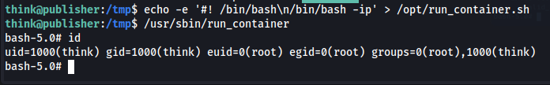

**ip of the machine :- 10.10.200.53**

machine is on!!!

found some open ports!!!

did aggressive scanning!!!

did directory fuzzing and didn't get some satisfied response so though of using another list and got some convincing response there.

what is spip?

Found spip version in the source code, let's find any possible exploits.

Got the exploit.

was unable to get revshell manually so had to convert to base64 and then decode it later on and further piping to bash to get a revshell.

got reverse shell....

one possible user "think" and user.txt found....

was not able to find the way to login as the user "think", then saw a .ssh directory and took the private key and logged in through ssh.

oooh!!! what shell is it I wonder!!!

was unable to find anything useful about the ash. So saw hint and then went to see app armor configs.

found /usr/sbin/ash in apparmor.d directory.

/opt/ directory access has been denied in this shell. Let's see if can shift to bash or have permission to shift to.

can execute bash shell. So let's do it.

found some files and most interestingly a script. Let's look at the script.

i typed "vim run_container.sh" and not can change in the src code.

was unable to get the pwned shell, so did a search for suid binaries/files, so found run_container is sbin as well.

so instead of creating a copy in /tmp directory, directly added the payload and executed the /usr/sbin/run_container binary and then got a pwned shell as root. Now to get the root flag got to the root directory.....