**ip of the machine :- 10.10.142.135**

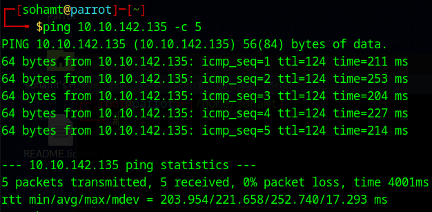
machine is on!!!

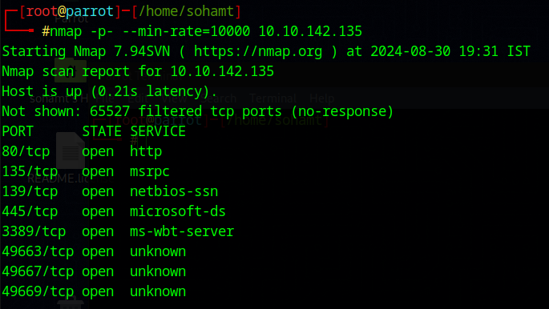
found some open ports...

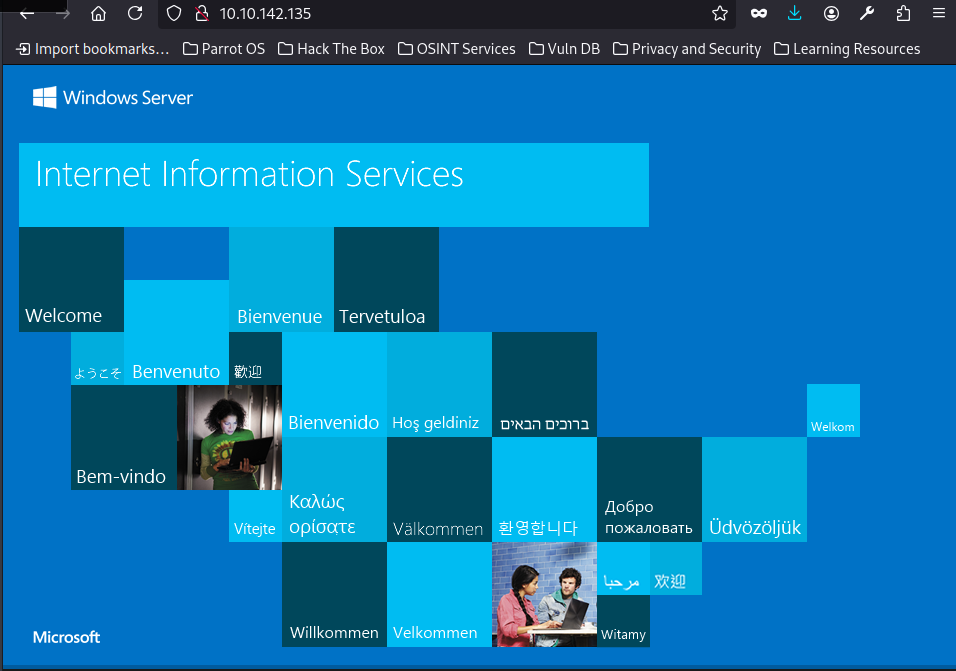
when visited with ip address assigned found a windows web server.

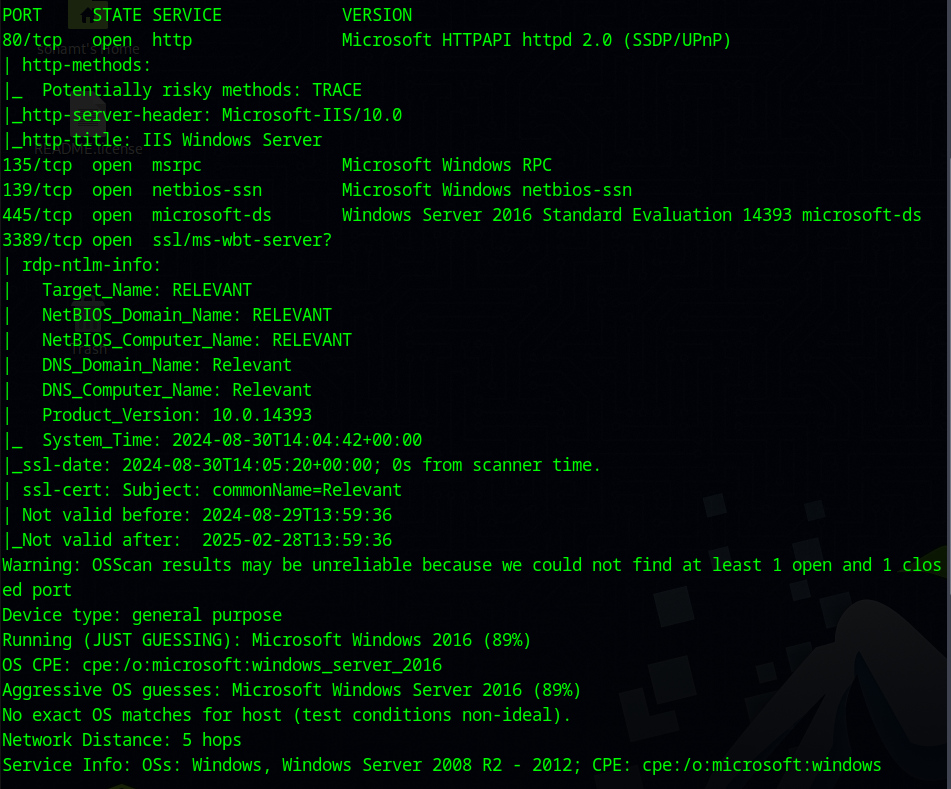
Some server related info from aggressive scan.

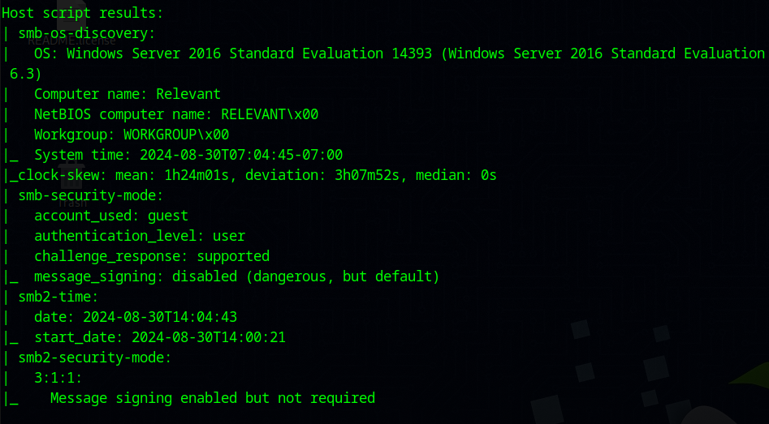
Info about SMB that is running on port 139.

Now will dig more towards smb and then will go for directory fuzzing.

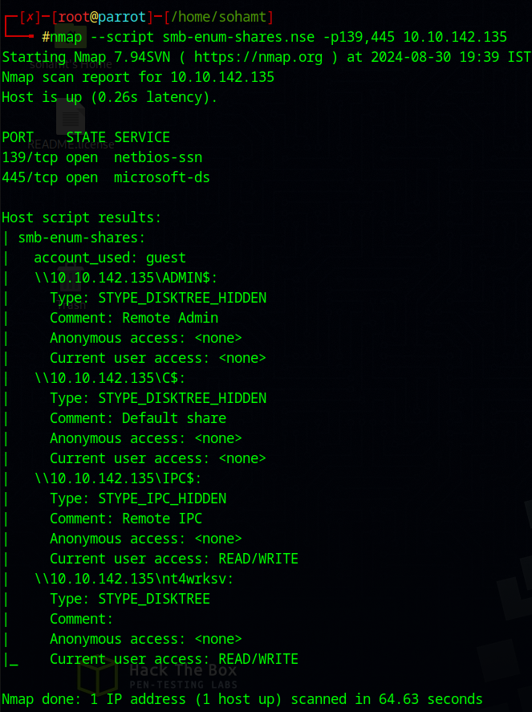
found some shares, let's try to access any one.

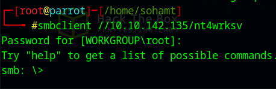
was able to connect to one.

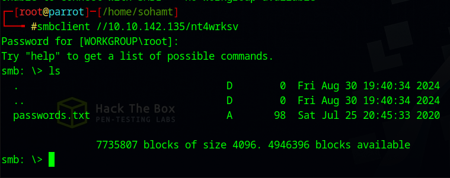
got a file.

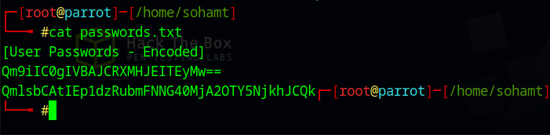
they look like base64 to me.

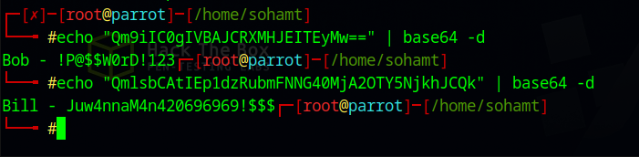
was right!!! got two possible username and passwords.

directory fuzzing was not working on default server port 80, so went to do directory fuzzing on port 49663 which is also running the same web server. Didn;t find anything in the web servers. So now will be uploading reverse shell directly to the share because we can write to it to get reverse shell.

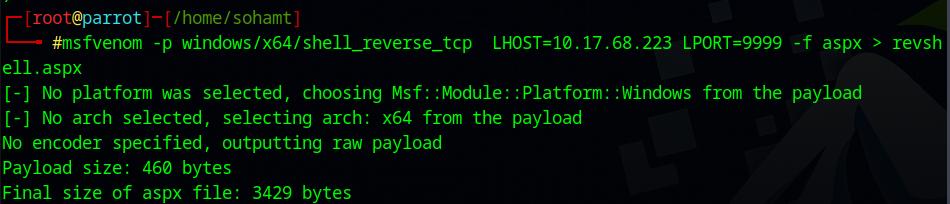
created a shell using msfvenom and with extension .aspx because of asp.net and we have to make the shell executable so that we can invoke it.

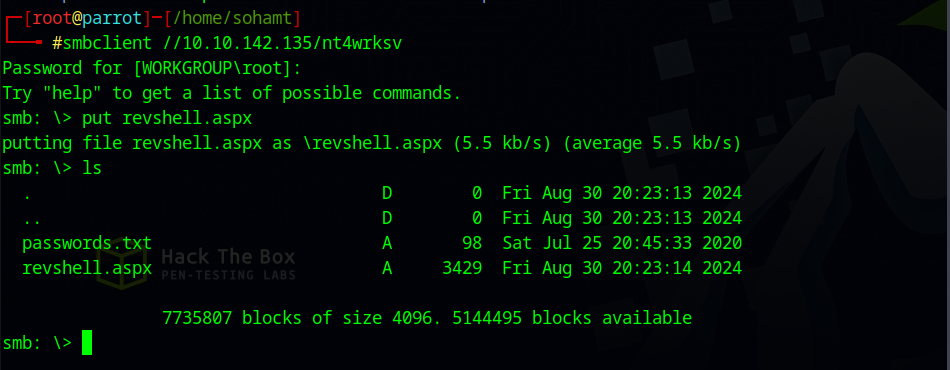
added revshell.aspx.

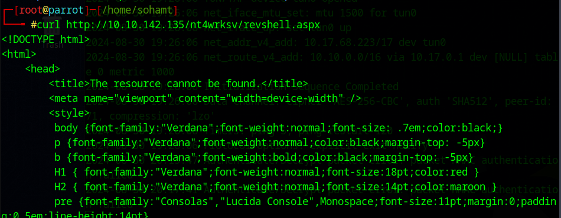
tried to invoke the shell with the help of web server but was unable to do it at port 80. But at port 49663, during directory fuzzing, it showed a much better response, although not a satisfying one but can we use it to invoke the shell.

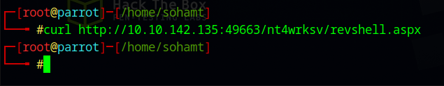
oops!!! nothing happened!!! Did we get the revshell.....

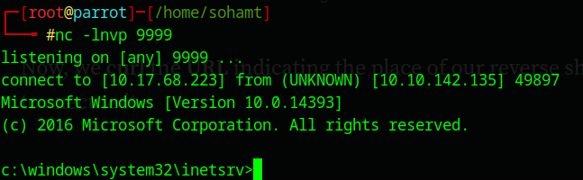
yay!!! got it.

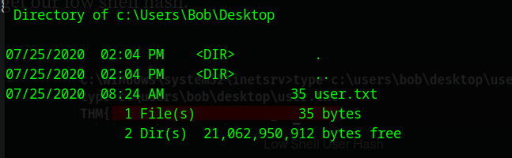
got the first flag in Desktop Directory of Bob. Now let's go for vertical priv esc.

**machine went off at this point so restarted it :- 10.10.72.27**

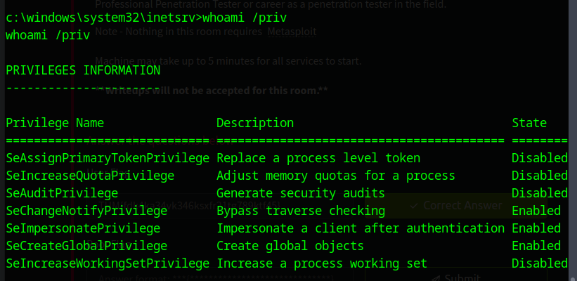
whoami /priv can be used to see privileges of the current user logged in as. SeImpersonatePrivilege looks interesting.

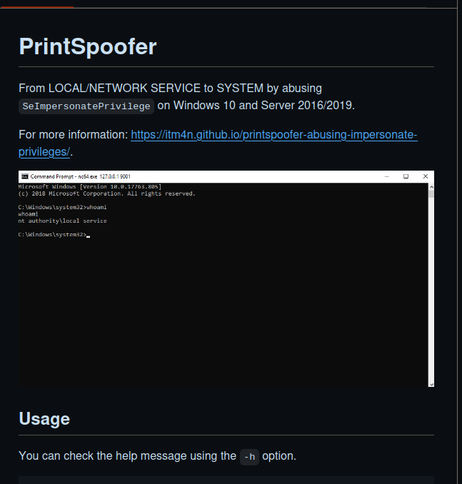
found this on github.com to escalate privileges. Let's follow it step by step.

So after README.md, here's what i'll do, 
will take printspoofer.exe and nc.exe and upload it in smb share and then will use printspoofer.exe to invoke another reverse shell which will get us privileges.

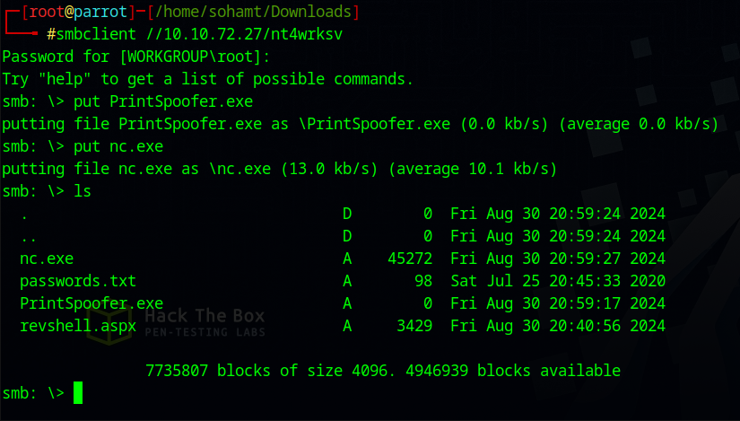
uploaded Printspoofer.exe and nc.exe to gain a revshell with higher privileges.

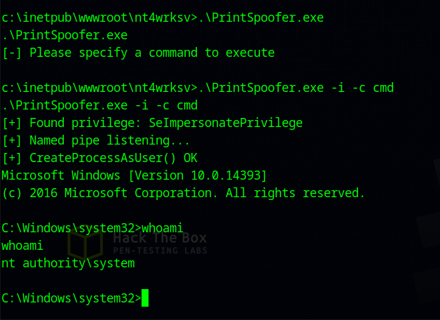
escalated privileges.

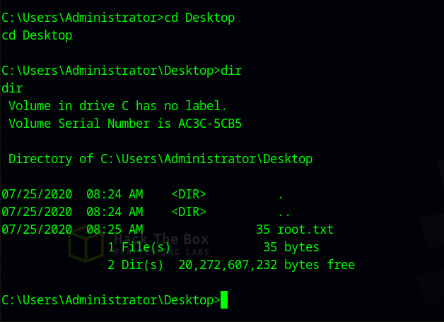
got flag in desktop directory of the administrator.