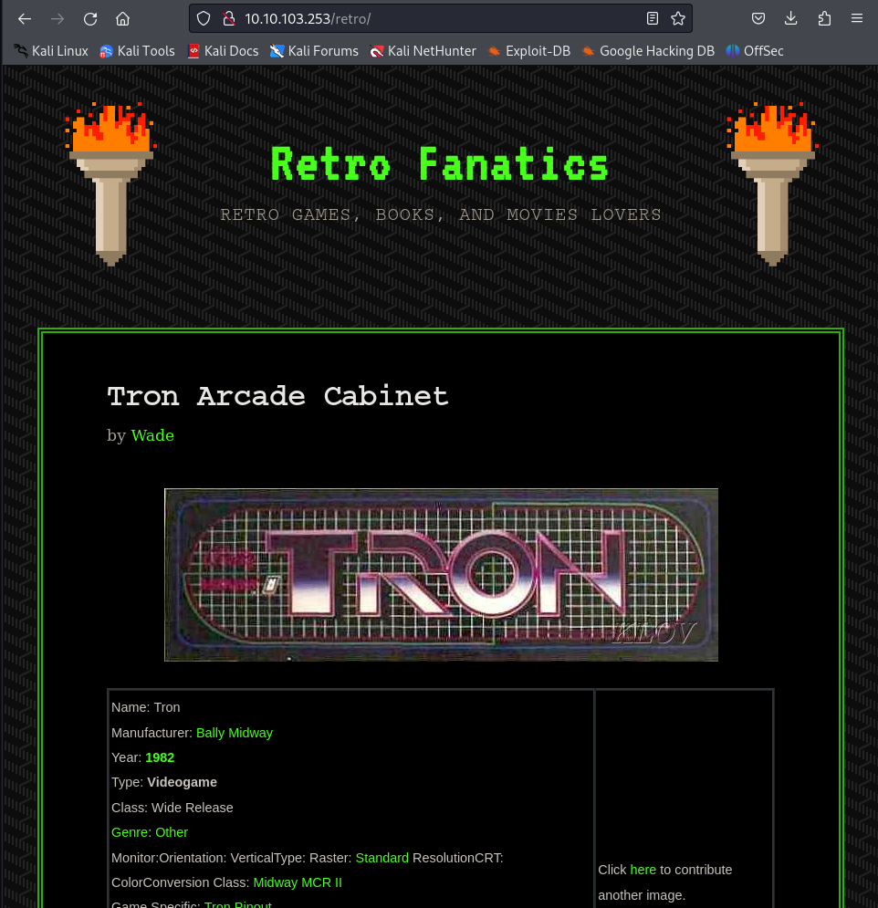
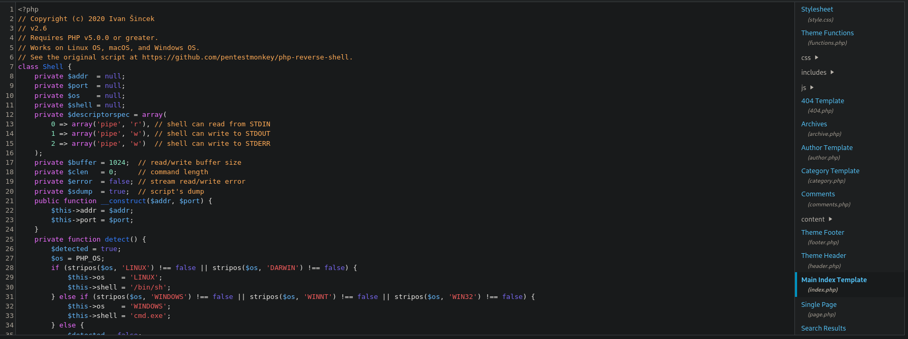

**ip :- 10.10.103.253**

machine is on and it is written it won't respond to the ping so will start with nmap scan directly.

Found two open ports.

did aggressive scan on the ports and also searched that RDP (Remote desktop protocol) is running at 3389. Let's do some directory fuzzing now.

oops!!! didn't find any directories using gobuster. Let's try wfuzz or ffuf.

using wfuzz found one named "retro". Let's go and visit it.

Hooray!!! found something.

with this block of code in src code, i am hinting that wordpress in some way and we should do directory fuzzing in /retro directory.

wpscan gave some positive responses thus confirming that wordpress is running. Wordpress version 5.2.1 is running which is vulnerable.

Tried to go to the default login page of the wordpress which is wp-login.php and it exists.

in /retro found that all the blogs are written by a user named "wade". Let's try it on login page.

password was wrong but atleast username is confirmed.

So will brute force it using hydra, either will go for rockyou or will create a custom wordlist using cewl. By both methods failed terribly. So had to study blogs uploaded by the user "wade" and have to do a lot of hit and trial.

in one of the blogs it was written ready player one so searched if user wade has any relation with ready player one, and found this. Wade is the protagonist of movie ready player one.

The user said in this post that he constantly mistypes the name of avatar of wade in the movie, I have watched the movie and the avatar of wade in the movie was "parzival". Let's try this as password.

hooray!!! loggin as wade.

was able to login using rdp with wade:parzival and got user.txt flag.

used whoami /priv to see privileges and saw that "SeChangeNotifyPrivilege" is enabled. Let's see if any exploit is available for it. Didn't find anything useful.

added reverse shell in one of the configuration (.php) file for reverse shell.

got it!!!

after getting got some info. about the privileges, as "SeChangeNotifyPrivilege" didn't had any exploit for priv esc. So will be checking other two.

found an exploit for "SeImpersonatePrivilege" 

printspoofer.exe didn't work.

So now will be using this blog by hacktricks for priv esc using juicypotato.

got some systeminfo first.

juicypotato didn't work for me.

then went to google of the rdp desktop env and found a cve in search.

also saw that the recycle bin is not empty and found a software.

and this is about the cve and how to exploit it.

it triggered the UAC prompt screen after restoring and clicking on it.

Then followed the second step and clicked on the "show more details" and now we can see publisher's certificate.

we can see "issued by".

now we can see "how we want to open the url" pop up and this also didn't work.

So i failed to exploit manually so now will be using metasploit for priv esc.

so after some research about the vulnerabilities, will be using this. It is basically juicypotato only but have to add options of juicypotato to achieve priv esc and again it didn't work.

Got root so after searching again came across a kernel exploit with an associated CVE and used it and got root shell.

this was the CVE associated with this exploit.

got the root flag.