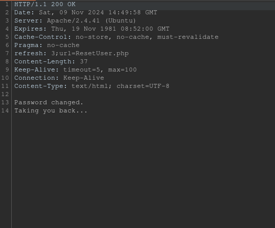
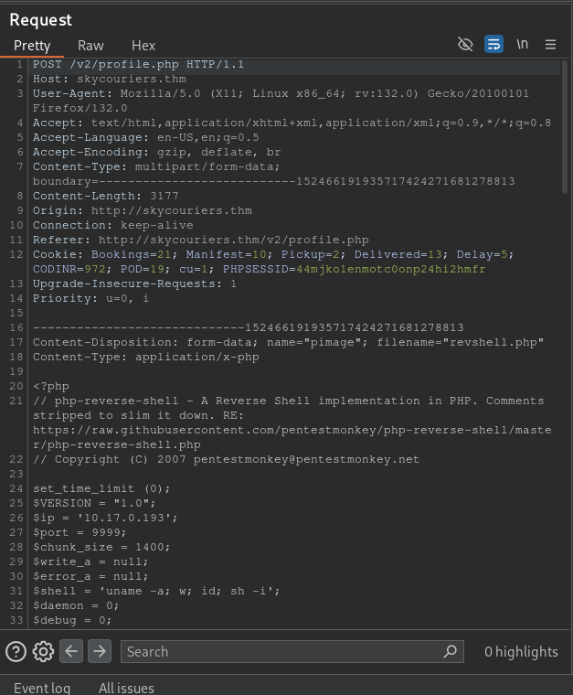

**ip of the machine :- 10.10.18.188**

machine is on!!!

Got two open ports!!!

Did an aggressive scan and got versions of the services.

Just a normal website.

Let's add skycouriers.thm in /etc/hosts.

Added!!!

Got some directories using ffuf.

Saw phpmyadmin but default creds. didn't work, but atleast now i know database exist.

Got a login page. Let's register.

Just created a dummy account...

SIGN IN!!!

Got a dashboard...

In profile section found email of the admin "admin@sky.thm".

Found a reset password page.

Observed the "forget password" request in burp suite. We can change the email id. Let's change it to the admin one.

password changed of the admin...

Let's try the new password.

Oh!!! Logged in!!!

In profile section we can upload our profile photo, so let's try to upload it...

So, uploading pentestmonkey reverse shell...

Now, when explored the response of the request after uploading, got the directory where our reverse shell would be. Let's trigger it!!!

It's loading...

Got initial access to the server.

Got a user in home directory.

Got user flag...

So, now in order to login as user "webdeveloper" we can login into mysql and find the password of the user but there are no mysql creds. hardcoded in phpmyadmin and anywhere else. So, ran "ps -ef" to see background and found something strange...

Mongodb is running...

So, searched and found that typing "mongo" will give an interactive prompt to access the database.

So, found the password of webdeveloper user.

Logged in as the user.

Found some SUID binaries.

pkexec with polkit!!! Found polkit and pkexec as SUID.

Also started another session through ssh...

in rev shell session, the process id is 1638.

Started a terminal agent using polkit in ssh session with process id of the reverse shell which is 1638.

So in rev shell session typed "pkexec /bin/bash" to invoke a bash shell and it asked for password in the ssh session because a terminal session of polkit is running which is from a process 1638.

After entering the password, got the root shell.

Got root flag!!!