**ip of the machine :- 10.10.140.36**

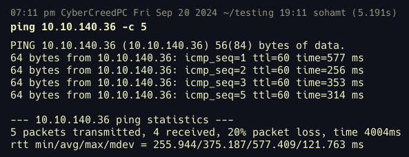
machine is on!!!

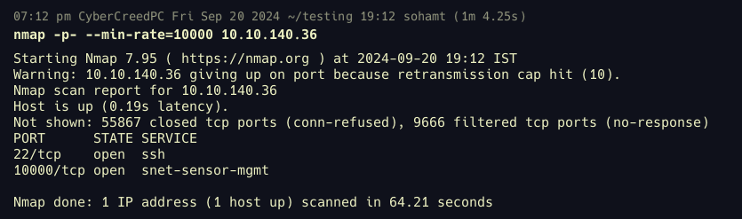
Only 2 ports are open but what is this service running at port 10000??

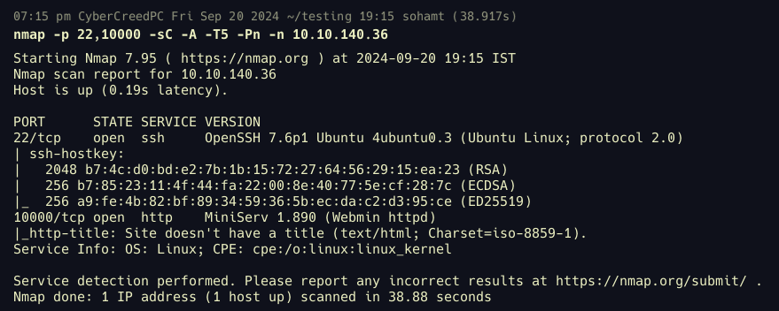
So on port 10000 at http server is running and is Webmin.

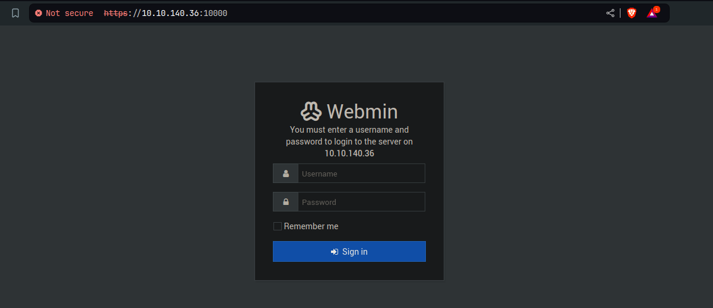
So before going for directory fuzzing, though of visiting web application manually and see what's going one, what's present etc.

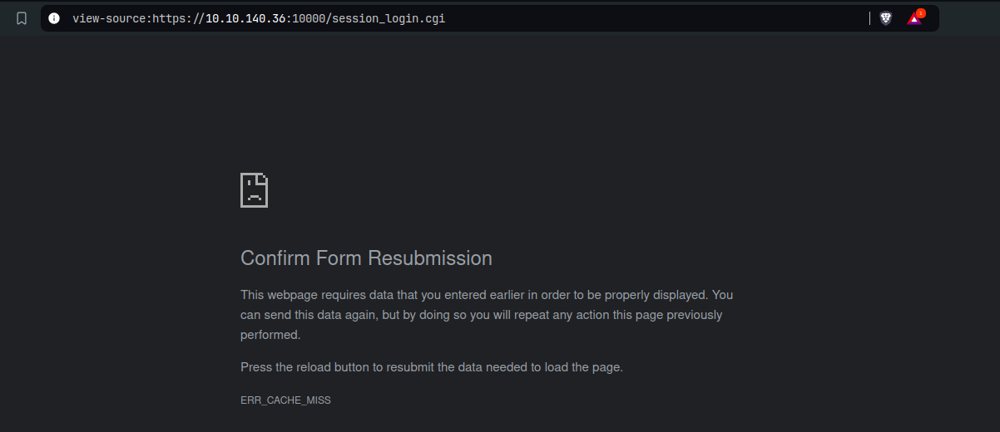
cannot view page source....

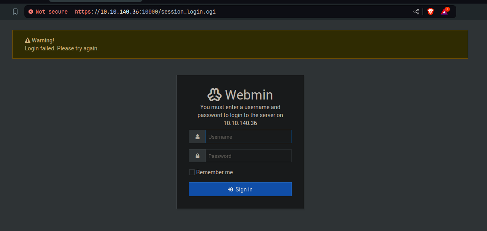no sql injection and xss possible as well. Let's look if there are any vulnerabilities that can give us RCE as we at least have the version though.

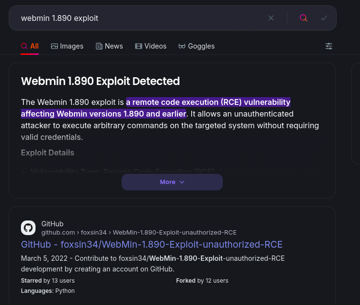
We found an exploit for unauthenticated RCE, which means we don't have to login and still we can get reverse shell to the backend server.

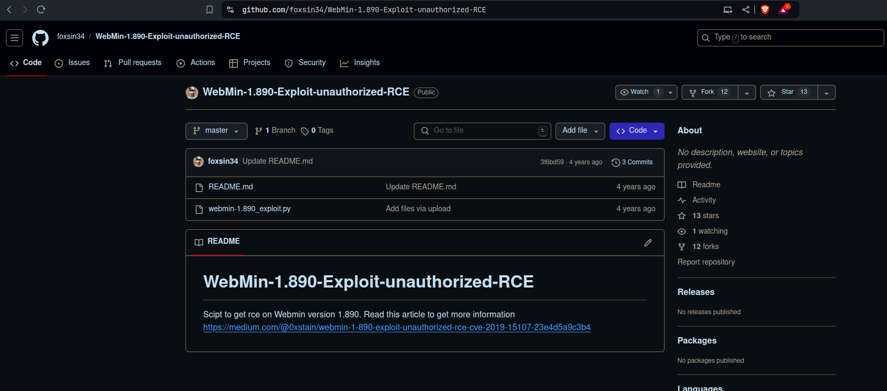
This is the exploit, will be using...

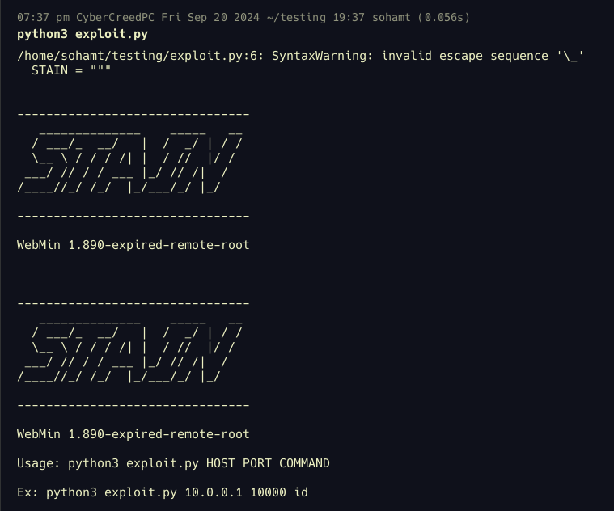
Let's use it with the help of provided example.

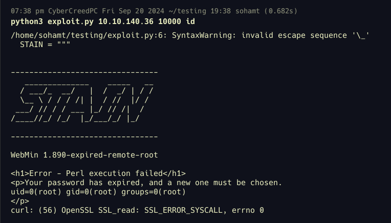
So ran it according to the given example provided by the exploit and got the id of root user. Now instead of id let's add reverse shell...

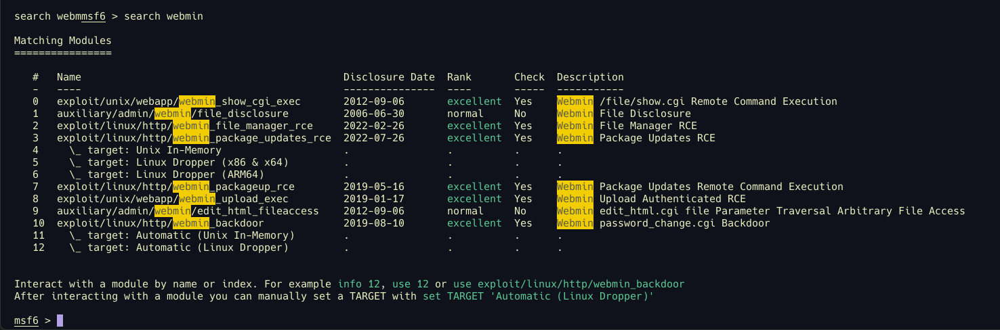
was unable to take a reverse shell through above exploit in python so will be using metasploit and found the exploit which no. 10. A backdoor for password change, which is what i looked in the above python exploit, so will be using that.

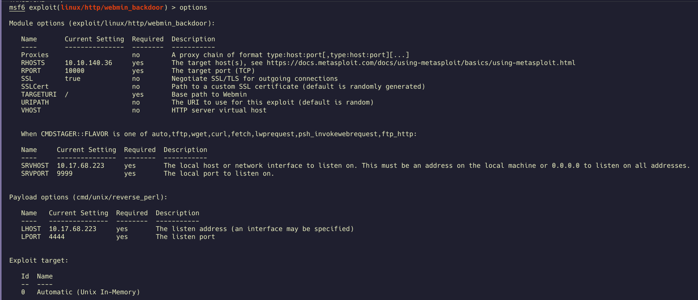
set all the options and enter exploit.

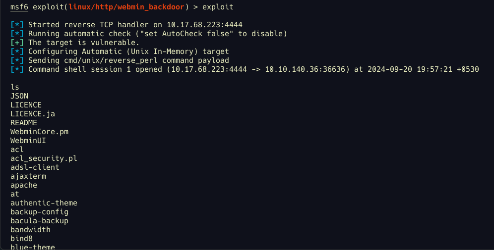
got reverse shell let's upgrade the shell.

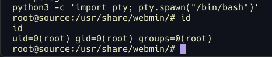
Directly logged in as root user after getting reverse shell.

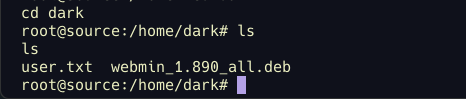
got our first flag...

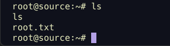
got our second/last flag...