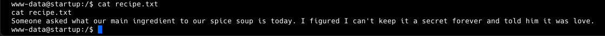
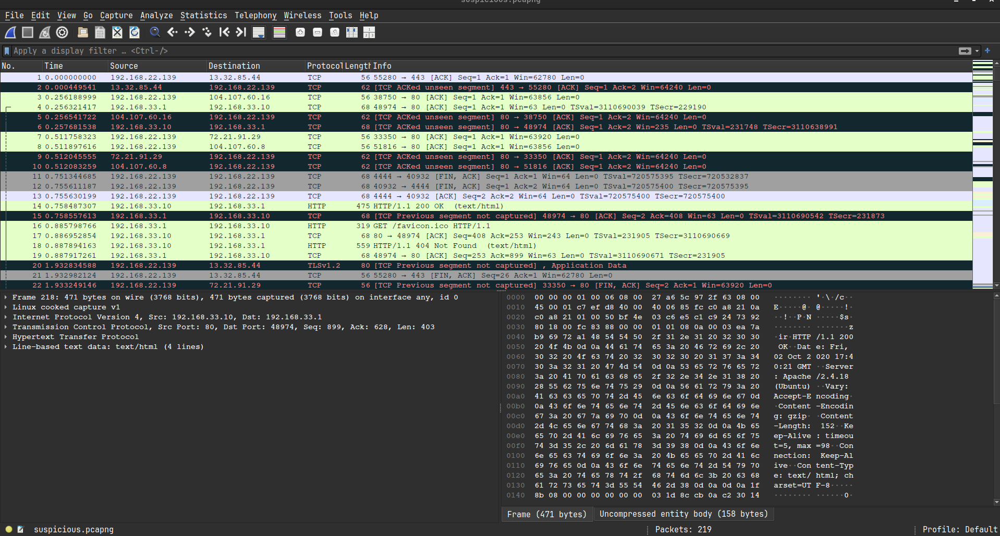
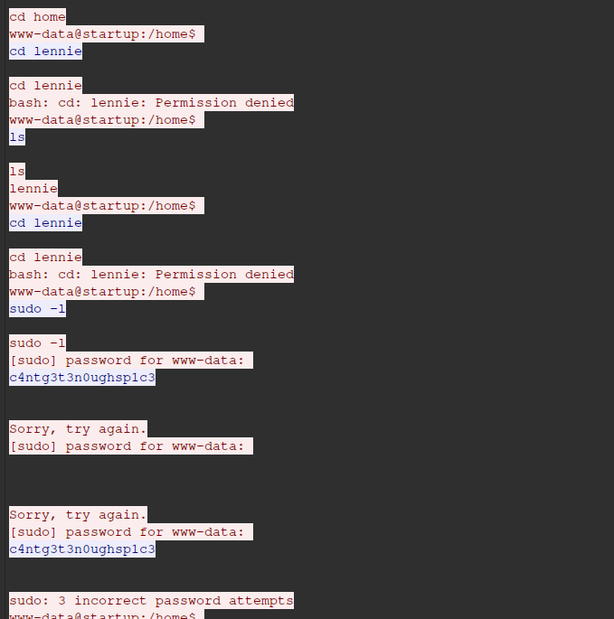
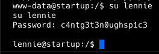
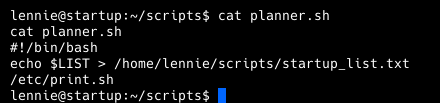

**ip of the machine :- 10.10.248.82**

machine is on!!!

only three open ports found.

Aggressive scan revealed some version info. and also revealed that we can login anonymously using ftp.

found two files and a directory. Let's start downloading important attachments first.

in notice.txt found a possible username "Maya".

"important.jpg" image's quality is pretty bad and is still around 256 bytes. But after looking at the hexdump of the image, i noticed that it has a file signature of .png image so have to change it.

Let's change some bytes, according to .jpg. After somechanges file got corrupt and nothing found inside the file.

Found nothing as such here.

used ffuf for directory fuzzing and found some interesting directories.

in /files directory got some files which we have already downloaded and analysed.

This means whatever is present in the ftp server can be accessed through web, it means that if we upload php rev. shell in ftp server we can actually invoke rev shell through web directory /files.

successfully added revshell in ftp directory on the ftp server.

So invoked the shell from web interface!!!

got a rev shell.

found a possible user.

but in /home found another!!! and access denied to user's home directory.

found a file and what the hell is "love" maybe password of the user.

nah!!!

in incident folder found a pcapng file. Let's transfer it to our system and analyse it.

opened the file in wireshark. Let's analyse particular streams.

in tcp stream 7 found a password.

was right logged in as lennie.

got our first flag.

In lennie user's home directory found three text files, and now will view them step-by-step.

oops cannot run anything with root privileges.

there was also a scripts directory in user's home directory and owner was root.

so viewed the script and found that whenever planner.sh script is ran, it will echo LIST variable values to the specified file and then call print.sh from /etc/directory. But as other we can only execute the script. Let's check /etc/print.sh.

only user, we are logged in as can edit print.sh script.

added a reverse shell in /etc/print.sh which will be called as root user and then we will get another reverse shell as root.

okkkkk!!!

got root flag!!!