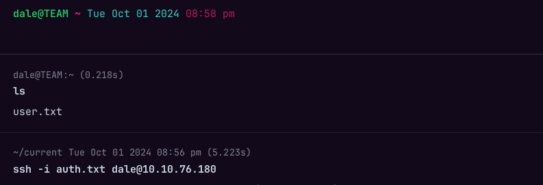

**ip of the machine :- 10.10.76.180**

machine is on!!!

got some open ports!!! will do aggressive scanning now....

Found versions of all the services running on required ports.

unable to login through default credentials anonymous:anonymous.

A web interface??? let's further enumerate..... src. code.

Didn't find anything in the src. code so now will be using ffuf for directory fuzzing.

oops!!! Didn't find anything...

Didn't find anything so looked at the src code again and found this.

let's add it in our /etc/hosts file.

After adding team.thm, it opened this site...

Now didn't find anything in the src. code as it is a template so will be doing subdomain enumeration now... using ffuf again....

Didn't find any subdomains.... so used gobuster with different wordlist.

found some interesting ones.... So added the domain in /etc/hosts file and went to the domain.

found a link... Let's move further...

Just a normal web page but url seemed fishy to me like the query page is referring/displaying a web page which is present on the server so maybe we can detect LFI (local file inclusion) here, which is seeing any sensitive file present on the server and see if we can execute some commands to get reverse shell or not.

Confirmed it is LFI....

Now after a bit formatting found two possible usernames Dale and gyles.

Was unable to find anything to get reverse  shell then came to know that i didn't do directory fuzzing further after adding domain in /etc/hosts file on the domain, so will do that now.

Found a lot of directories that i missed.

We found dale username before while performing Test for LFI, so maybe we have to login as dale first...

Only robots.txt worked for many and not anything else.
So thought of looking for private key of dale but didn't find it in home directory so went looking for /etc/ssh/sshd_config which was displayed because by default an ssh key can be in user's home directory which it was not displaying, so went looking for above file.

private key of dale...

was able to logged in as user "dale" with the private key.

got first flag...

So went to see for .bash_history file and saw this...

can run /home/gyles/admin_checks as user gyles....

backup creation file probably...

So don't have any permissions to edit that file so went to home directory to see more users...

wooh!!! we have already done that......

So after running the file as the user "gyles", went to /var/stats directory and saw logs, nothing impressive.

So after finding no clue, simply ran linpeas.....

Didn't find anything so went to /var/www/ directory to find some more stuff..

So found two scripts ,out of which one has a password of ftpuser.

So while running the script as dale, tried to do some random hit and trial stuff..... added /bin/bash in input...

and got a shell as user "gyles".

So got two interesting files for .bash_history file of user gyles.

as cron job in /opt huh!!!

So in backup directories multiple files are there that can be edited by people of admin group which gyles is a part of let's edit one of them.

So added a reverse shell in one of the two files.

So after adding reverse shell we have to wait for like a minute as there is a cronjob running and then we will get root shell.

Got root flag.....