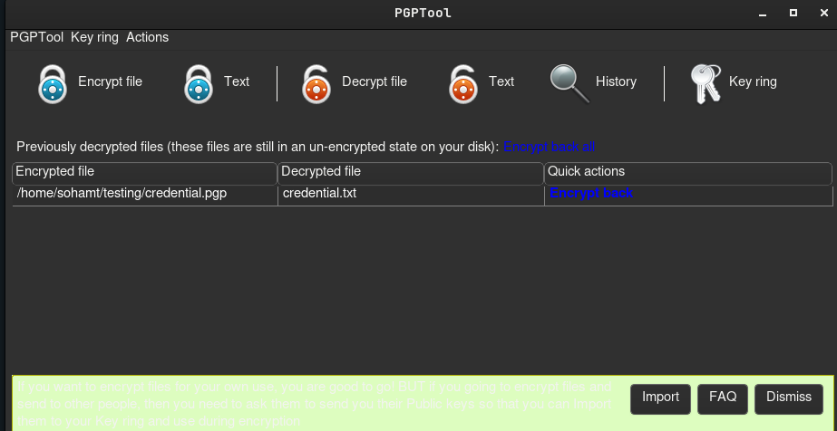

**ip of the machine :- 10.10.142.34**

machine is on!!!

got some open ports.

Did an aggressive scan and found an apache web server an port 8080.

Now let's start directory fuzzing using ffuf.

Found some directories. Let's view them manually.. So didn't find anything in the directories which was pleasing except the version of tomcat which was "9.0.30".

I searched apache tomcat 9.0.30 exploits and it gave an exploit of metasploit.

So after more digging came to know that this was based on a CVE where we can manipulate apache jserv protocol which basically pre-configured with apache tomcat 9.0.30 and AJP is running on port 8009 so let's use the exploit and see what happens.

So after setting all the options, we run the exploit.

Got some creds. May be for ssh...

was right, for ssh for user "skyfuck".

there are many interesting files in users home directory. Let's see them manually.

in tryhackme.asc file found a private key. That's strange!!!

credential.pgp file. But looks a bit distorted. So let's search what the hell .pgp is.

to crack pgp (which is used to encrypt creds.) we need a passphrase and a PGP private key. We have a private key and .pgp file. Let's look for the passphrase.

came around this. Might be helpful!!!

First transferred the hash of the private gpg key to hash.txt file.

then cracked the private key passphrase ("alexandru")

So used this tool known as PGPTool for this purpose, here you have to add your private key, then add the encrypted file (.pgp) and then after entering passphrase you will get the decrypted content in a file.

So got another creds.

Before logging as another user, also searched if user skyfuck can run anything as sudo and was unsuccessful.

logged in as another user now, thus performed horizontal priv esc.

found first flag.

merlin can run /usr/bin/zip as sudo with no pass. Let's go to GTFObins.

So following this way to get root/pwned shell.

yay!!! got it!!!

also got last flag!!!
