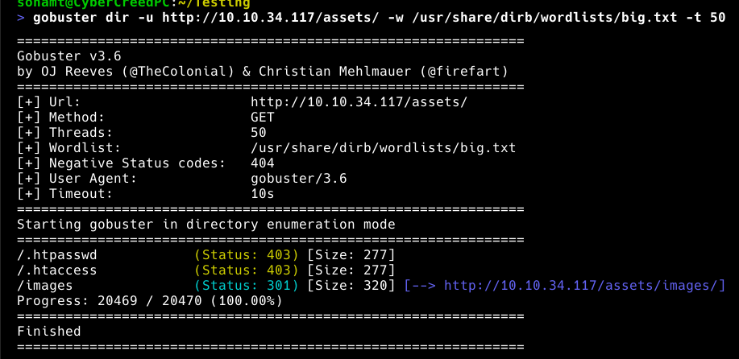

**ip of the machine :- 10.10.34.117**

machine is on!!!

found some open ports!!!

So found the versions of the services running on these ports.

Did directory fuzzing using gobuster and found decent results.

Further will be fuzzing /assets/ directory.

found some more. Also did a Common php file name scan because it doesn't show php files.

Told ya!!! Found one!!!!

/images we cannot access.

So was not able to find anything as such in the machine for rev shell, so out of curiosity asked "leo" about possible php vulnerabilities, and command injection is what we can try at least by modifying the parameters and query in the language.

So i added a query cmd with "whoami" command and got this gibberish stuff which said www-data and we also found a place to add revshell to.

Bash payload was not working so tried adding python payload which is the second most common for revshell after bash and surprisingly it worked.

So in a directory named hidden content, found a file and a passphrase in it. Definitely base64 encoded.

Okay!!! now let's see where to use it!!!!

found possible usernames.

We got two images which we downloaded. Now it said passphrase and not password, so maybe it is the passphrase to protect steganography. So let's use steghide for it.

It is showing file format not supported let's see hexdump to see what's the problem.

it has a PNG file signature so converted to .png but still it showed the same error. So earlier the file was in jpg, so let's change the hexadecimal values of hexdump to match jpg.

also used file command btw and it showed data, which means something is in there.

so changed in in hexed.it

got a file!!!

Got creds of the user "deku".

was able to login as deku!!!

got first flag.

found a script in /opt directory.

Now after understanding the script's source code, 

generate a ssh key in local system not victim's machine.

after running the script as sudo as user deku can only run that, it said feedback saved. SO saved this public key generated to /root/.ssh/authorized_keys file.

Then we can login using the private key to directly get root privileges.

we got final flag.....