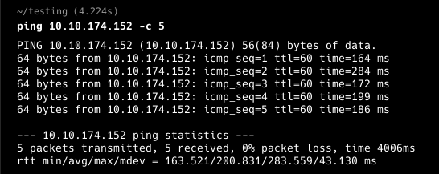

**ip of the machine :- 10.10.174.152**

machine is on!!!

only two open ports!!!

did an aggressive scan and found some versions of the services running.

got some directories....

going to the only directory we got, and got an application running and was unable to figure out what to do manually, so decided to directory fuzzing further on /sitemap directory.

wooh!!! got .ssh.... Let's see that....

got a private key to login through ssh.

So was finding here and there for a username and found one on home page itself. "jessie"

was able to login as user "jessie" with the ssh private key.

found first flag in user's Documents directory.

user "jessie" can run wget command as root user with no passwd.

To exploit wget to get our last/root flag.

sent the flag through wget to the open port on attacking machine, and got the last flag.