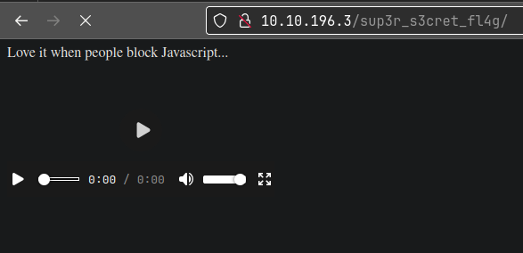

**ip of the machine :- 10.10.196.3**

machine is on!!!

Got three open ports...

Found version of the services running on the open ports.

anonymous login not allowed!!!

got some directories after scanning.

Also looked at the src. code after inspecting and didn't find anything. We can only look on one directory which is /assets directory.

found two files...

rick rolled'

in style.css file saw these two commented lines. Let's look at this above mentioned page.

it is showing us this...

after clicking ok, we are redirected on youtube and got rick rolled...

So i used script blocker to block js on the web page and this was coming.

So i was being confused what to do next, so went to burp suite and start visiting website again and again till i get something interesting and in one of them saw something,

a hidden directory!!! and that to a get request...

so went to the hidden directory and found an image...

So downloaded image and started binwalk but didn't found anything then did strings.

got possible user "ftpuser" and now we have to brute force the password.

So created a password list of all possible password combinations.

cracked it!!!

So pass of ftpuser is "5iez1wGXKfPKQ"

Finally logged in!!!

Oohh!!! creds....

Got creds. but it's a bit gibberish though!!!

So i asked chatgpt which language it is, and it said brainfuck.

So simply went to an online Brainfuck compiler and executed the code and got our creds.
User: eli
Password: DSpDiM1wAEwid

entered as user eli and also got a message from someone and came to know about a hiding place, probably a hidden directory.

eli cannot run anything as sudo.\

there is also another user, let's try to perform horizontal priv. esc.

So another user has the first flag but cannot view it. Let's go and look at that secret directory "gwendoline" user was talkin' about.

Found it!!!

this s3cr3t directory has a hidden file. Let's see it.

Hah!!! found password of "Gwendoline" user directly in a message so called secret text file. Let's go and get our first flag.

Logged in as another user "gwendoline"...

After getting the first flag, did "sudo -l" and saw that user we are logged in as only access to user.txt file and "vi" command.

So privilege escalation using vi and user.txt file was not working and it had (ALL, !root) and not (ALL, ALL) which as usual so searched about this change in sudoers file probably....

So after entering the weird permissions directly on the browser it gave me an exploit of exploitdb.

let's download it and try to use it. (CVE-2019-14287)

So this exploit didn't work so have to manually exploit by understanding the code.

So in code there was an example, if any user cannot run /bin/bash then we can use exploit and then that command to actually bypass it and it is a vulnerability of sudo command.

First write this command.

this is our previous flag file.

Now vi is running as root user and in order to get a root shell.

first type this and then press enter.

Now enter this to envoke the shell.

Thus, successfully escalated privileges and found our last flag.