**ip of the machine :- 10.10.109.191**

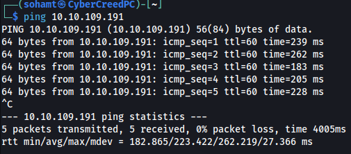
machine on!!!

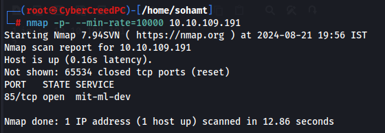
only port is open but what is it??

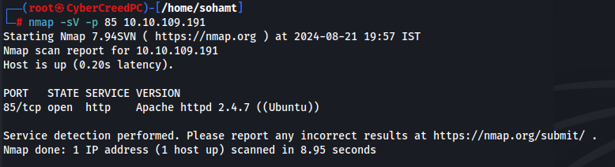
an http server is running at port 85.

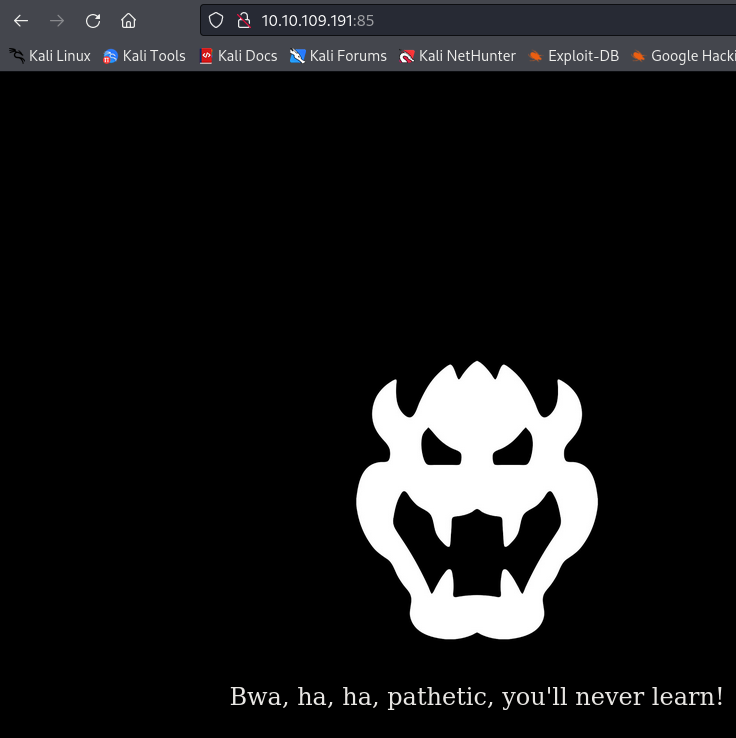
found nothing on inspecting/viewing the source code.

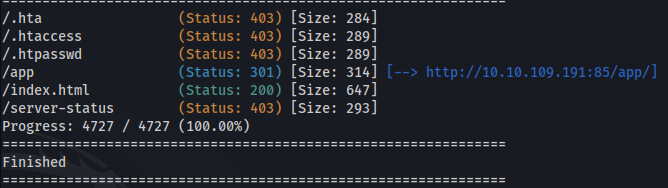
on directory fuzzing found these results.

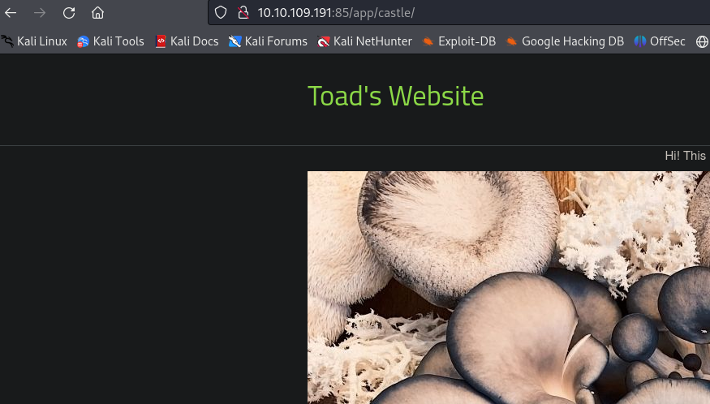
after going to app directory found this web page.

**changed ip :- 10.10.84.11**

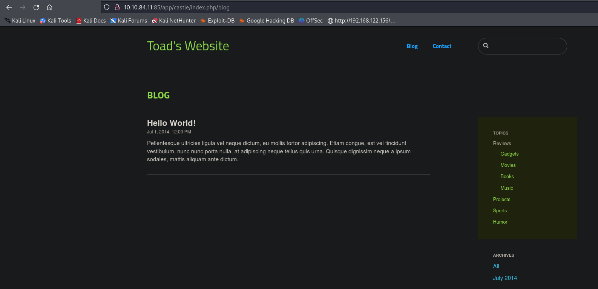
saw a blog and /index.php/ in url. Then tried to inspect the source code.

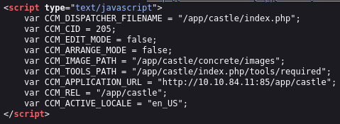
found this in src code which depicts the directory of the image.

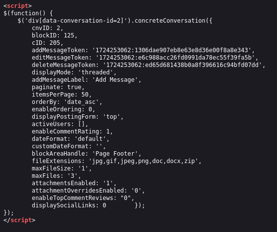
also found this which told about the file extensions allowed.

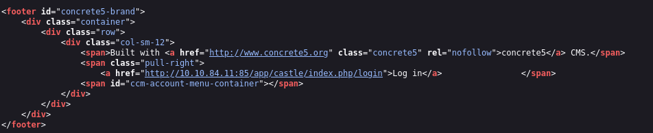
in footer section of the src code found a login page link.

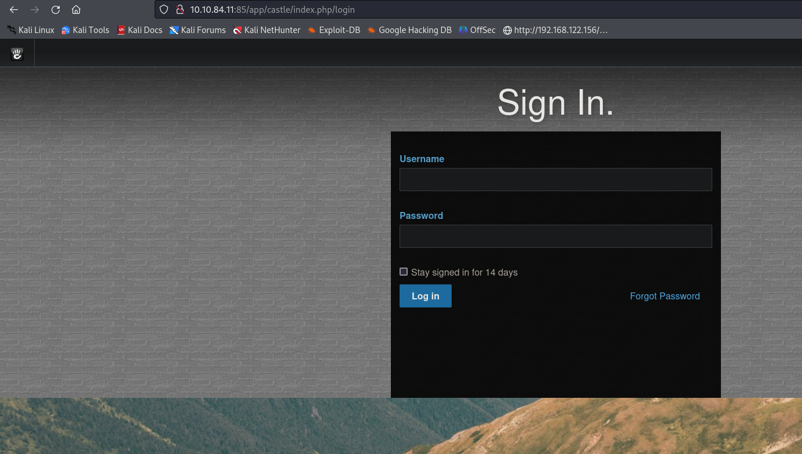
found a login page.

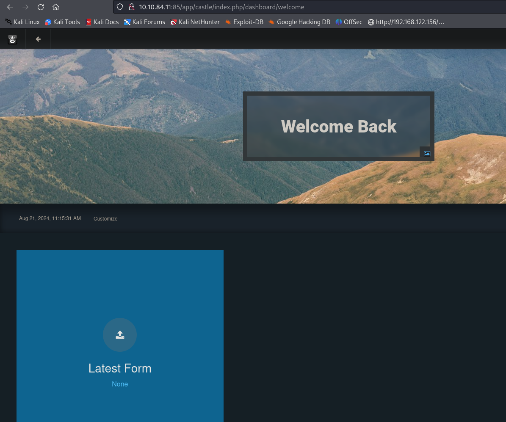
oops!!! logged in with admin:password creds. didn't brute force using hydra.

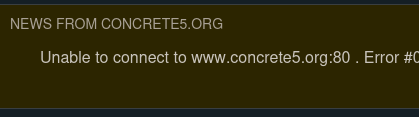
huh!!! what is concrete5??

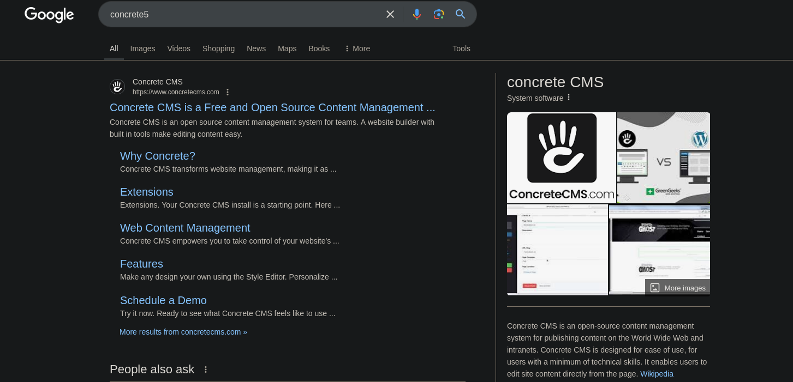
it is a cms system like other vulnerable php ones. Then, let's search for any possible exploits.

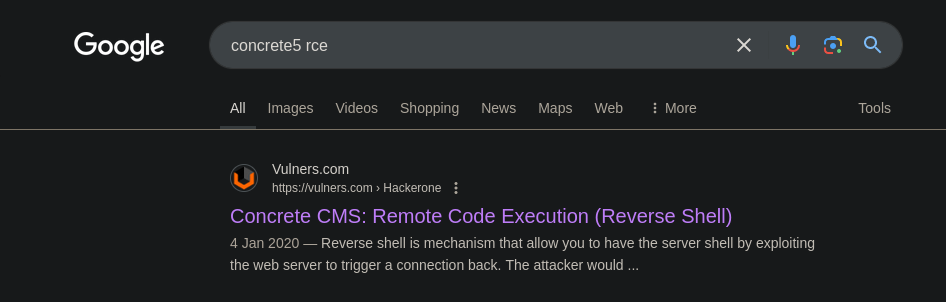
found first website to be helpful to get a reverse shell.

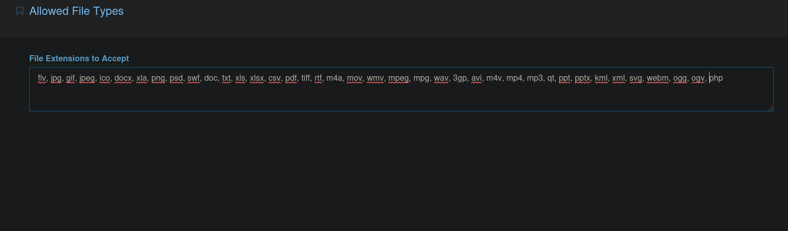
go to allowed file types and add .php extension and save it so that we can add a reverse shell script.

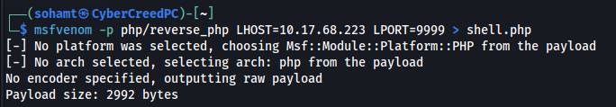
now generated a reverse shell using msfvenom.

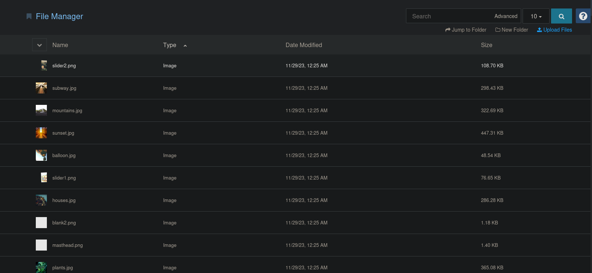
go to file manager and click on upload files and upload the reverse shell.

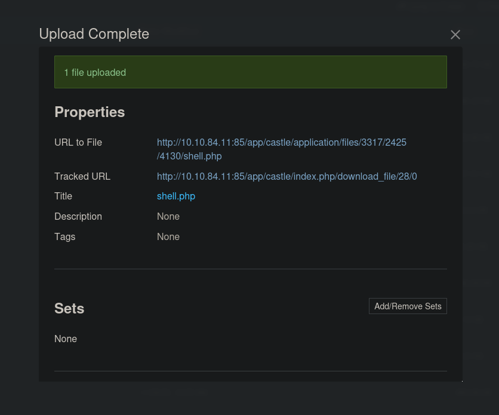
uploaded the rev. shell

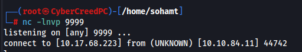
clicked on the file and got a reverse shell.

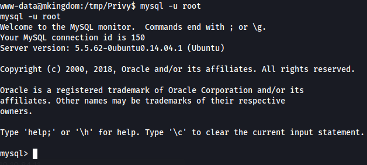
able to access mysql database with no pass.

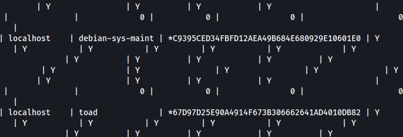
found some possible pass and a username "toad"

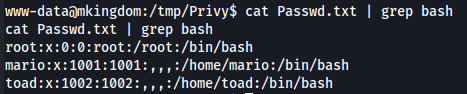
got another possible username "mario" as well.

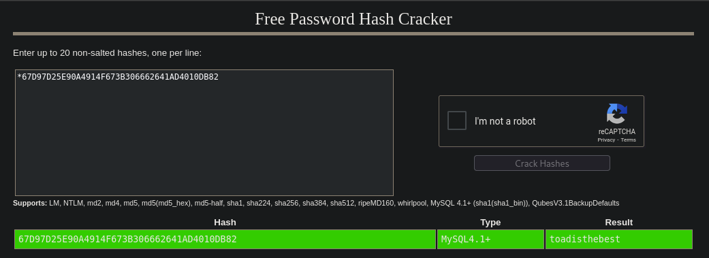
got password for the user toad.

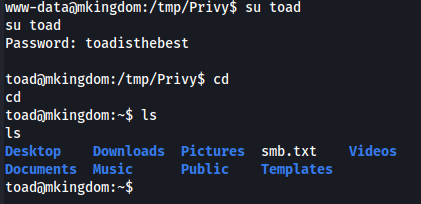
was able to login as toad.

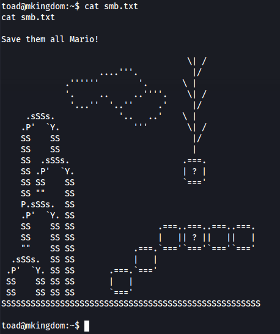
only found a file with this and nothing much interesting. Let's try to login as another user "mario"

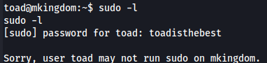
Well!! we have to login as mario. Toad is useless for us.

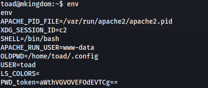
in env. variables found a strange base64.

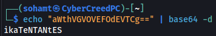
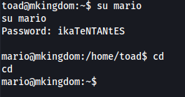
logged in as mario user and mario can run only one command which is id.

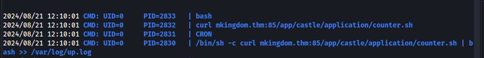
ran pspy script to see all the bg process and found these running after some intervals.

So it is downloading a script known as counter.sh from a link and executing it.
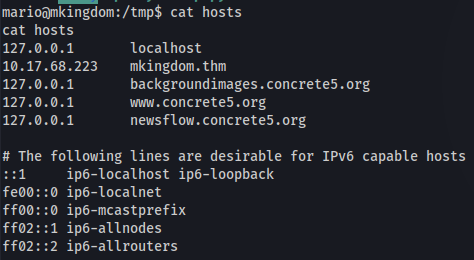
/etc/hosts file was writeable so added my ip and started a web server on the machine at port 85 so that it can fetch a script with same name and execute it.

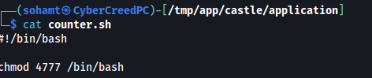
added shell in the file with suid permissions and after the file is fetched and executed /bin/bash will get SUID permissions and that to of root user.

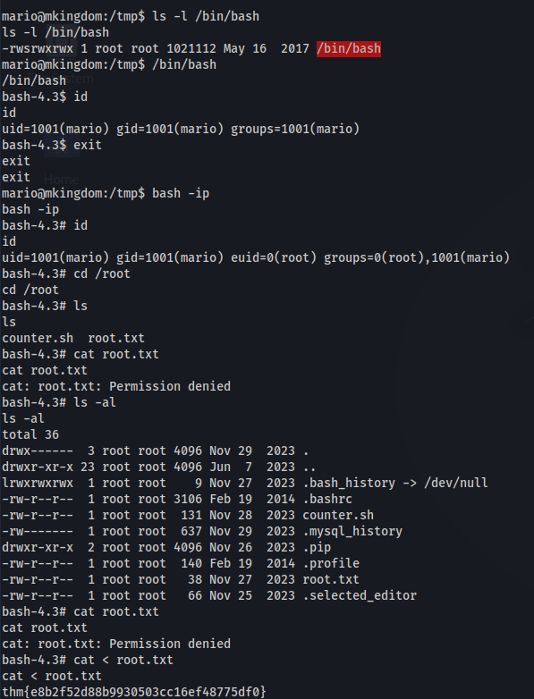
bash shell got SUID permissions, so executed the shell with enforced permissions and got a root shell and then root flag......