**ip address of the machine :- 10.10.143.140**

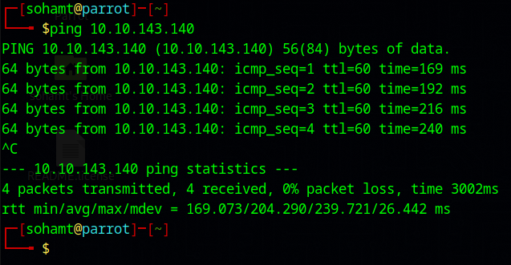
First, tried to ping the machine to see whether up or not.

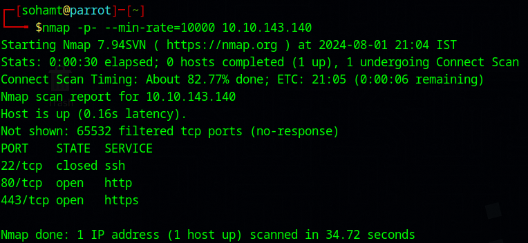
Did an all port scan and found three ports.

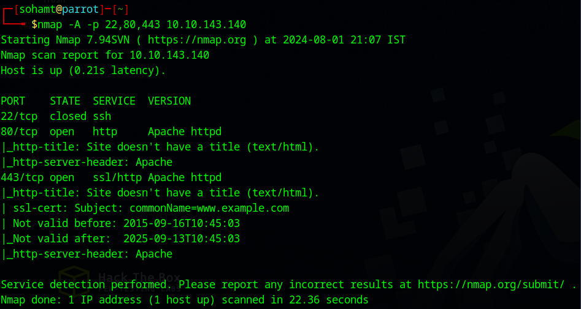
Did a script scan and didn't find anything interesting.

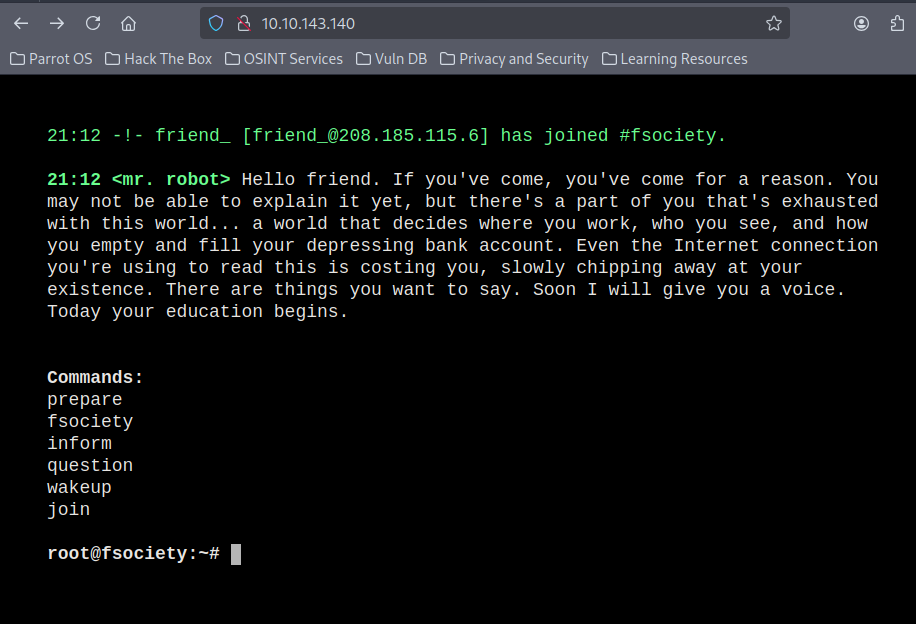
went on website/web server content machine is hosting.

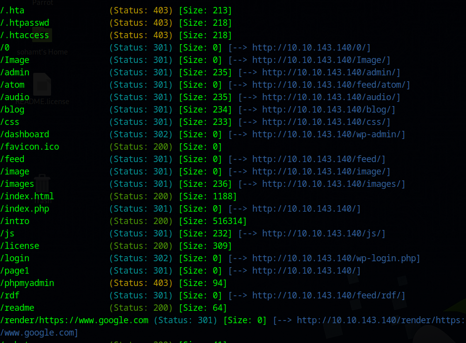
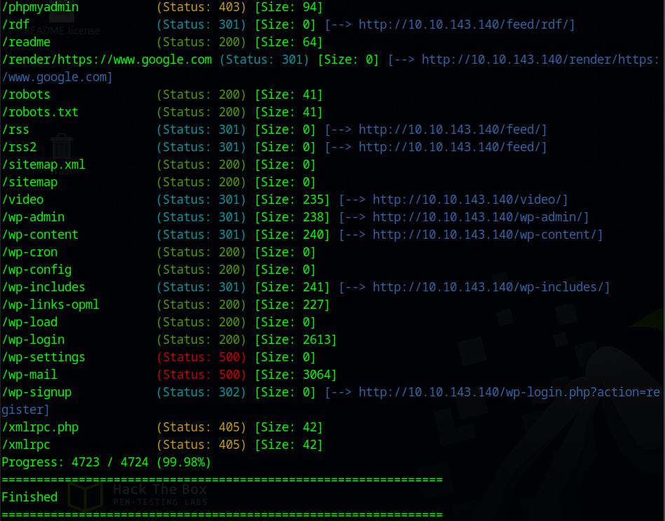
Used gobuster for directory fuzzing and found a lot of directories. Now let's start looking at these directories and see what we can find.

/0 first to see what we can find.
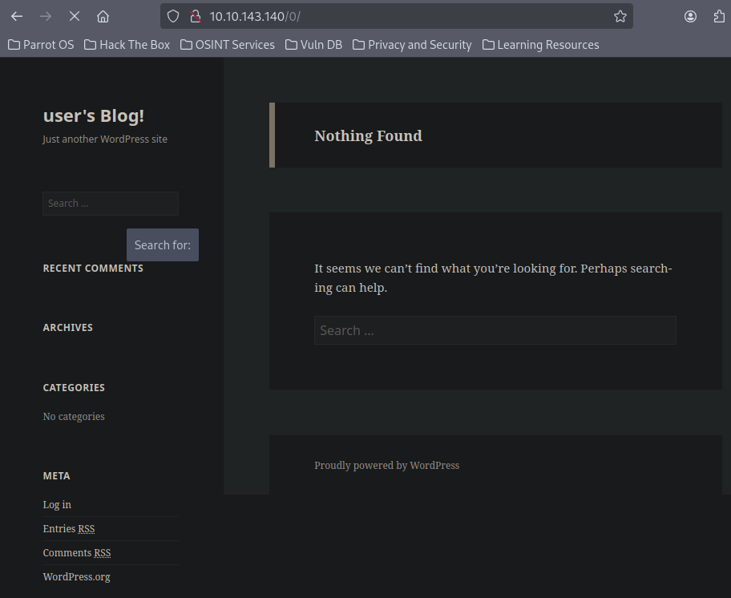
we can see that it is running php which has a lot of vulnerabilities.

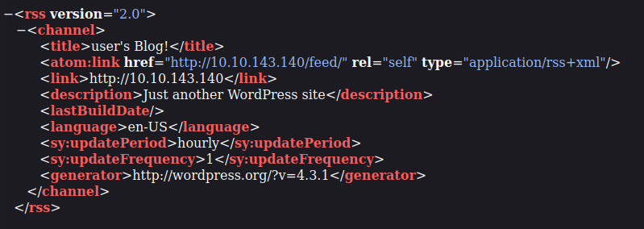
got an xml file form /0 web page and it is mentioning the version of wordpress which is helpful and another possible directory which is the same as /o itself.

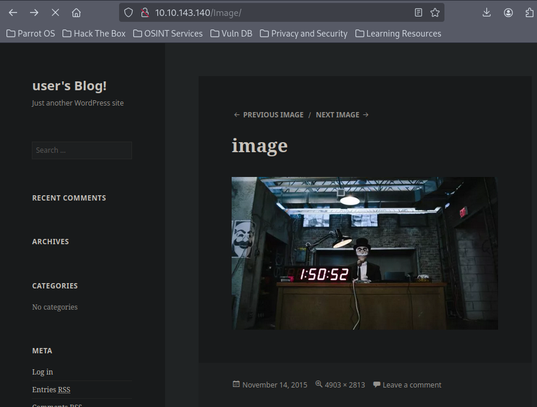
/image doesn't gave anything interesting.

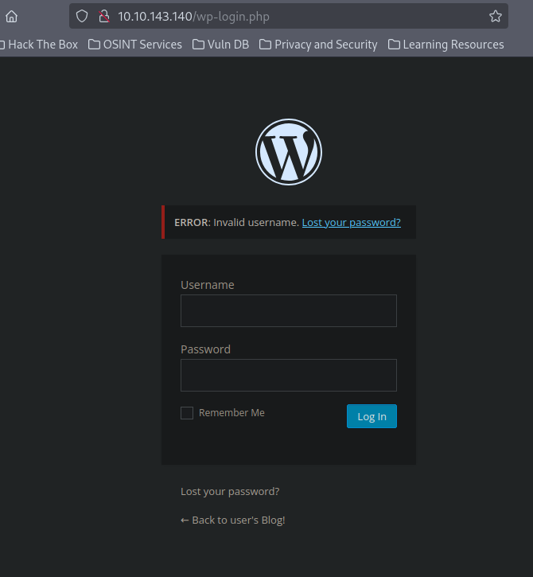
in /wp-admin found this login page.

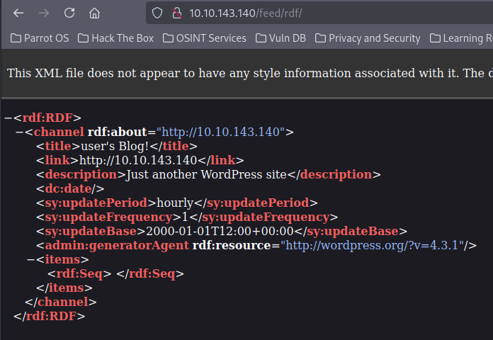
getting this by visiting most of the web pages.

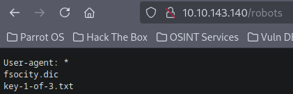
got something in /robots and a possible file name "key-1-of-3.txt".

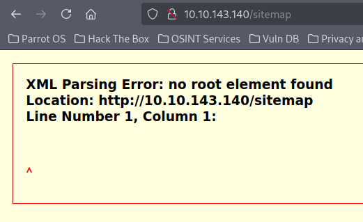
found this in /sitemap.

rest didn't find anything interesting.
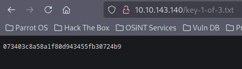
got a file in /robots directory and thought of seeing it and got first flag.

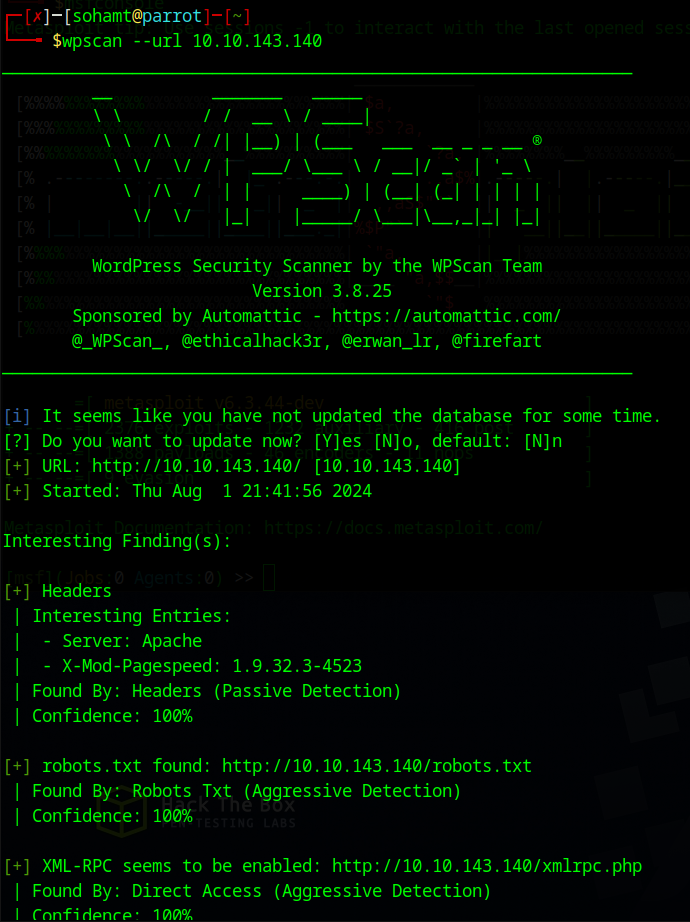
as machine was using wordpress so thought of using wpscan to find something.

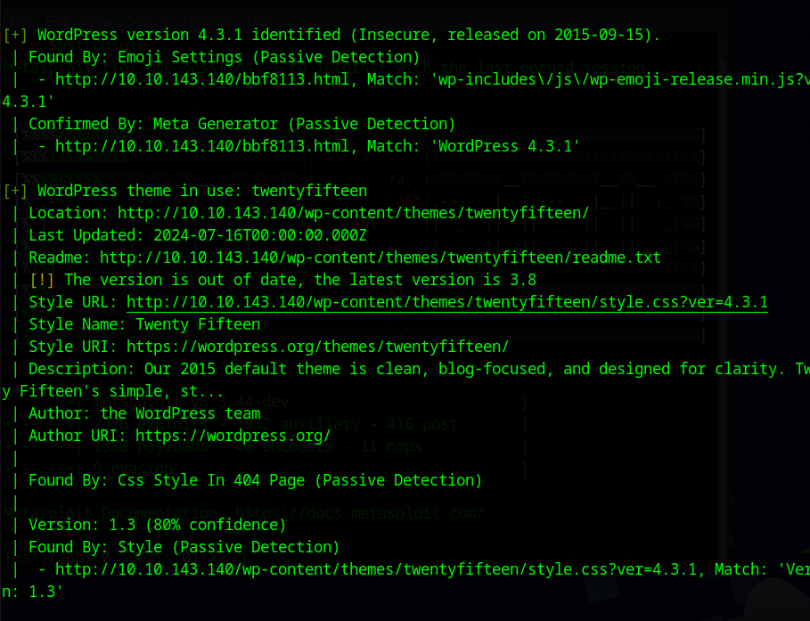
it also said that version that is running is outdated which we already found.

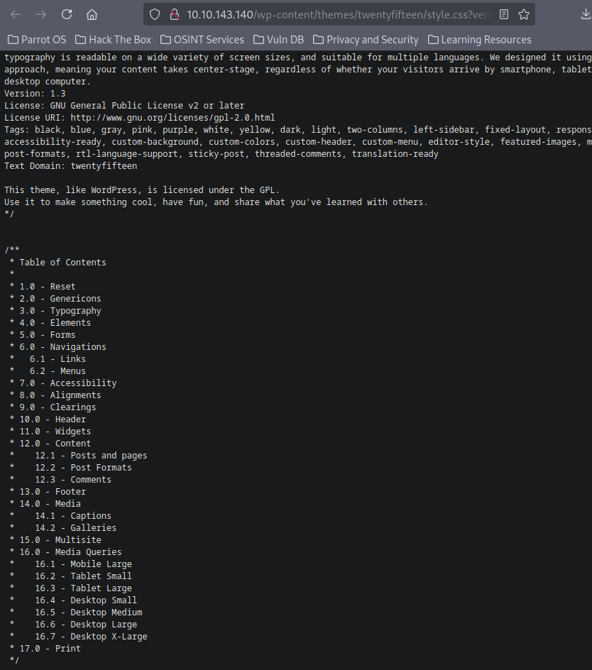
in some other file, also found this hierarchy.

Now let's see if any exploit is available to get a reverse shell or something.
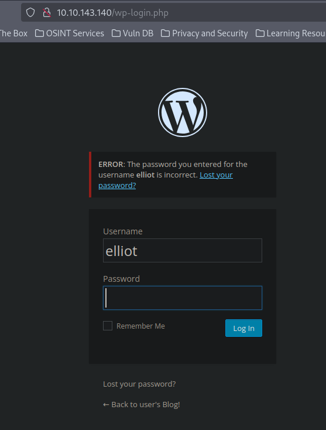
found possible username as "elliot" let's see if we can find password.

Also found another file in /robots.txt which is fsocity.dic which is a dictionary file.
And **By the way restarted the machine so got a new ip :- 10.10.250.120**

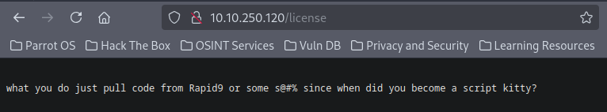
wget this license file and will get base64 and then decode it.
possible username and password.
elliot:ER28-0652

after logging we will see all the inboxes and editor tabs to see if we can take reverse shell or not.
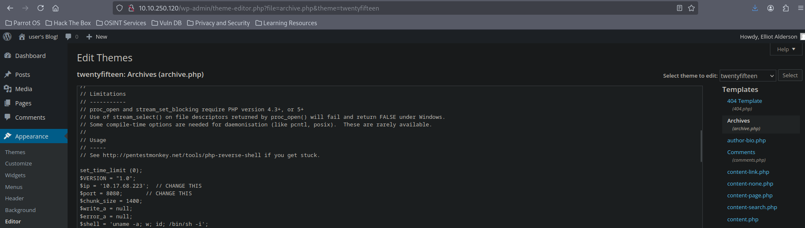
so we got it added a php reverse shell script by pentestmonkey in archive.php and it can be accessed through a url which we found when applied wpscan which will help us to give the url to visit to get reverse shell.

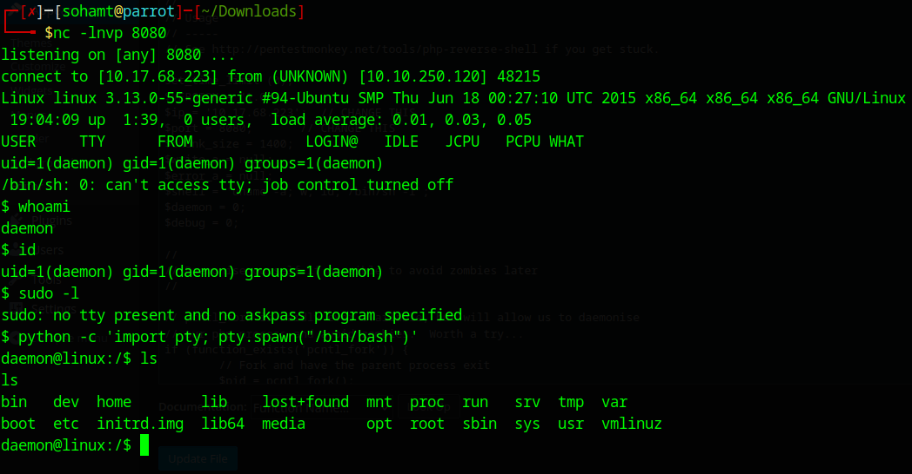

Didn't find any useful information in Network info, cronjobs and mysql after running priv esc script.
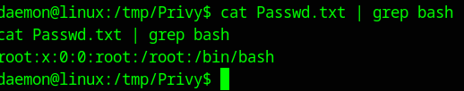
only root is running the default shell as bash.
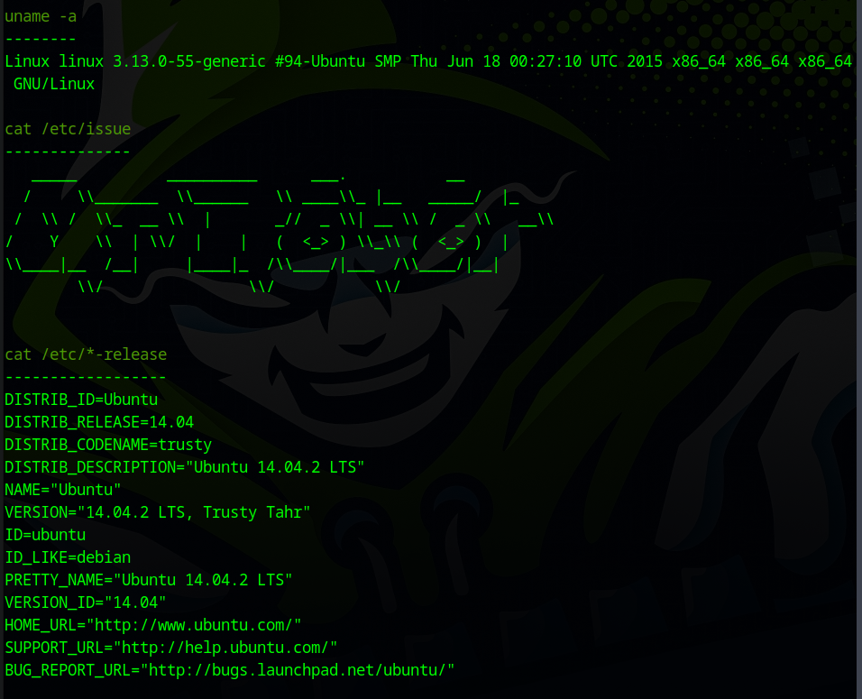
Got some kernel and system info.

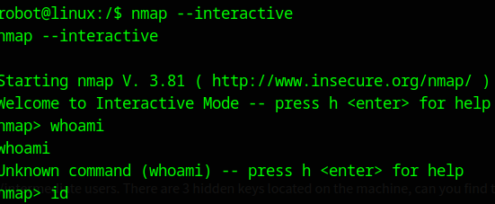
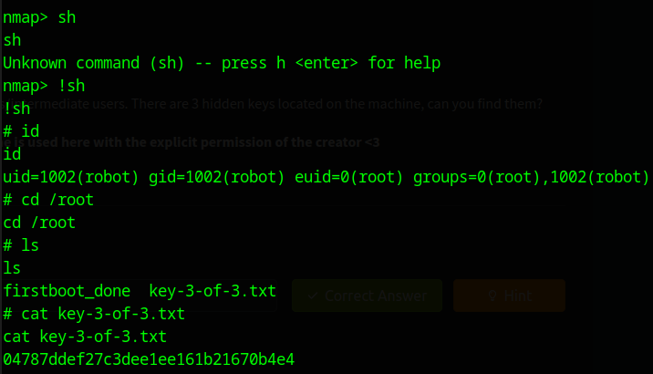
nmap was running old version so gone to GTFObins so searched and got interactive and got 3rd flag.