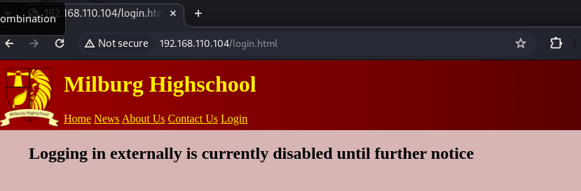
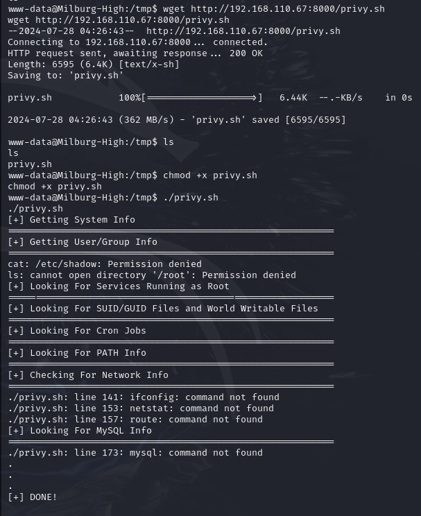

**ip address of the machine :- 192.168.110.104**

First pinged the host to see if host is up or not.

Scanned for open ports.

For versioning got to know that some web pages are present that seem strange and ssh is running on non-default port which 25468.

From gobuster found that /robots.txt can be accessed directly so we'll see that after using nikto for other vulnerabilities.

From nikto found that /robots.txt has three entries, /login.html can be used to login as admin and nothing else.

Visited Website, let's look at the source code first.
Didn't find anything interesting in the source code.

Only news one worked and here got some possible usernames.
Dean MacDuffy (Principle)
Alex Johns (head coach)

Got this in news.html source code, possibly base64.

it was base64!!!

Found another web page.

Got a contact.html page as well.

Found this after visiting /robots.txt

Visited /passwords.html first and found this.

Another from bob and it seems bob is an IT admin or something from IT and he says a web shell is running and there has been a breach in the company recently.

This means we cannot login externally.

This may be the web shell Bob is talking about and is unprotected which means anyone can use it.

only "id" command is working so let's use id along with other command in one line.

added reverse shell payload with id and pipe symbol to get a reverse shell.

finally got reverse shell!!!!

Now will run privy.sh in the machine to discover vulnerabilities and escalate privileges.

Now let's further analyse files.

in CronJobs.txt didn't find anything and MySQL can be accessed easily as root with no password.
NetworkInfo file is just a normal file only.
PATH-Info.txt file contains just normal stuff nothing unusual.

all users running bash as there shell in the system.
Nothing new in Root Services file.

Got only one world writeable file in SUID-GUID.txt. But none can be used to escalate privileges after searching and trying acc. to GTFObins.
Unable to access Shadow.txt file.

Got some important sysInfo which can be used further for exploitation if we do not find anything further.
found home directories of every user and are just normal home directories and found a file

in a user name elliot's home directory and also one in bob's home directory.

and was able to read both the files because we have permissions.

in this file elliot says that Sebastian's password is "Qwerty" which he suggested him.

oops!! got some creds. finally in bob's home directory file. But sebastian (seb) has some pretty good creds though instead james has qwerty as pass.

theadminisdumb file says that seb and jc are new IT staff members and we know that an ssh port is open at a non-default port so let's those credentials over there.

with jc's creds. was able to login through ssh.

was able to visit and see files and directories in bob's home directory.

Found this executable and ran it. Boring huh!!!!
But if we take first letter of every line it creates "HARPOCRATES". And i though it is the password of bob but it is not.

we found login.txt.gpg file. So maybe HARPOCRATES is the passphrase of the file to decrypt or extract the the text.

logged in as jc and was able to get bob's pass.

we can see bob can run all the commands.

so did sudo /bin/bash to get a shell as root user. Thus. escalated privileges.

Got the root flag.......................