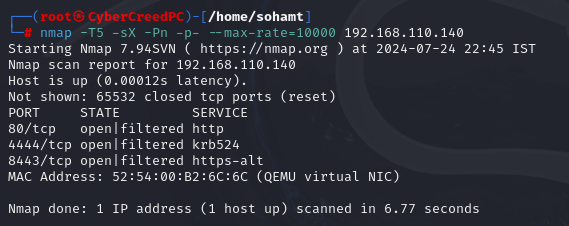
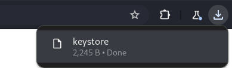
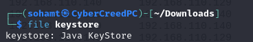
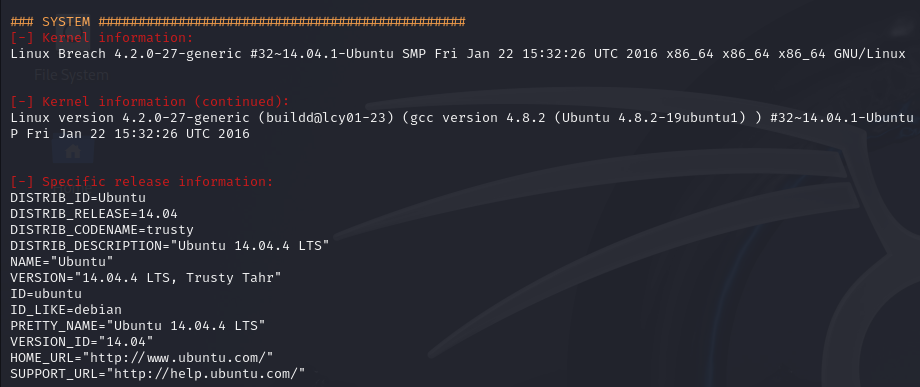
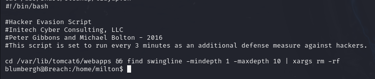

ip address of the machine 192.168.110.140/24

**Enumeration** (nmap)

First we did a nmap ping scan also known as ping scan or ping sweep (-sn) to see whether the host is up or not.

Now, we saw that host is up so we used  -Pn to not ping the host and directly scanning all the ports by using (-p-) and -T5 to speed up the process and using --max-rate=10000 to further speed up the process by sending 10000 packets per second and -o is for the output file. 
So, basically we can see that all the ports are open literally all 65535 ports which is highly unlikely and unusual.
Now, having these many ports being open is close to impossible so may be a firewall or any security mechanism is enforced which is giving us incorrect results so we have to do an  xmas which will send a malformed package and want to receive RST flag in response of this malformed request.

So after doing xmas scan we received that three ports are open and filtered means that we can expect a firewall to act or perform on these ports.
Now after finding open ports we will go for version scanning on these ports to understand more about the services running on these ports.

So after running version scanning (-sV) we can see that at port 80 HTTP server is running and operating system is ubuntu.

Now to get more further in-depth scanning can be done using -A which runs three types of scans (traceroute, version scanning, os detection) and get more verbose information.

**Directory Fuzzing** (gobuster)
So we noticed that it is running http on port 80 and that to an apache in ubuntu so lets go to http://192.168.110.140.

So there must be some directories in the web server where we can find further things for exploitation so now will be doing directory fuzzing using "gobuster".

So, while doing directory fuzzing we found many directories with status codes and here, in this command -w stands for wordlist and "dir" for finding directories with an associated url (-u). 
So here, we can see that if there is a 400 status code we cannot access them which means we have to further inspect 200 and 300 status codes ones which are .gitignore, images and index.html.

**Vulnerability Scanning** (nikto)
"nikto" is a tool that can be used to scan web server for known vulnerabilities.

So here we have used nikto on the machine and creating an output file using (-o)

So nikto revealed this information, and here we can see that **apache server machine is running is outdated**. We also found **.gitignore** which contains the directory structure of the machine (web server) and **/#wp-config.php#** file which contains credentials. We can also see **/icons/README file** which is the apache default file.
.gitignore file

icons/README file

Unable to access the config file directly through url modification.

**Web app Enumeration**
After manual web app inspection we found about two users and a little backstory on the web page. (Bill Lumbergh and Peter GIbbons)

now let's again visit /images directory and try to look at each image.

Only first image was of some use and it hinted to look at the source code of the website at home page.

Now after seeing source code we can see that we found a link to **initech website** just by clicking on the image on the home page.

In source code, also found this base64 string which means something so will be decoding it on cyberchef. It was a double encoded base64.

so here after using cyberchef, found some credentials.
( pgibbons : damnitfeel$goodtobeagang $ta )
( username : passwords )
So now let's visit another website which was "initech.html" and see what we can find there.

First we will see the source code and see what we can find and we found nothing. So here, home page, cake and stapler are those images we saw in images directory but now the employee portal is something new so we will inspect that.

We have to enter some credentials, so let's try entering the one we found.

After entering found credentials we were able to enter into peter gibbons account. 
So now we will be clicking everywhere to see what we can find.

After clicking on inbox we found some mails in it. Now will be inspecting the mails further.

at last third mail found a really interesting file. ( 192.168.110.140/.keystore ) and we also find another possible username : admin@breach.local

After visiting this url we downloaded this file.
Now further exploring more options further.
So in banners tab fond this directory.

In search tab we found that we can search for members of the company.

In edit account option we were able to find more about our logged in user.

Now let's explore search tab that is given.

So after entering bill or admin we found nothing but after entering "peter" which is we are logged in as, we found a .pcap file and some more information which is "alias, storepassword, keypassword are all set to 'tomcat' ".

**Analysing the files and further accessing webpages** (.pcap and keystore)
Now first we saw what type of file keystore is and we found out it is a "java keystore" file which is used to store digital certificates.

On some browser searches also came to know that this file is also used to store corresponding public and private key pairs and is used in TLS connection.

Also a tool was also being seen which is a certificate and key management utility.
Will be using this tool to export the certificate from the **keystore file** and then will be adding this certificate into the wireshark to decrypt the HTTPS ( TLS ) traffic. 

We knew about ' tomcat ' when we were inspecting the mails in inbox. 

When we tried to add the certificate into wireshark we got this error which means that certificate should be in format of PKCS12 and not x.509.

Did some browser searches and came to know that file of pkcs12 is .p12.
So, will be using "keytool" to generate a certificate in pkcs12 format.

Now after importing certificate in edit -> preferences -> protocol -> TLS -> RSA keys
Now we have imported for TLS protocol so we will be able to follow TLS stream only and not TCP.

Now we will notice that we have successfully bypassed SSL/TLS handshake conversations between client and server after importing the certificate.

Found this authorisation header in one of the get request which was giving 200 status code.
Also found some other credentials as well which was giving 401 status so didn't though of it.
Let's see if this encoded string might contain something....

got some creds. of the tomcat account.

the request was made at this url with 8443 port which has HTTPS connection for which we didin't get any information.

So when we add the url with https and at the port 8443 it comes with a pop up with username and password which we already found which was of tomcat.

Just after adding credentials we landed to the tomcat page of the web application.
                            OR
Another way of accessing the above webpage using burpsuite by adding client TLS certificate to burpsuite ......
We can add client certificate that we got manually by going to settings -> network -> TLS -> client TLS certificates

Remember that if we add client TLS certificate to the burp settings and then use burp proxy in browser then we can directly open by entering ip:port/where_we_want_to_go but if we don't user client TLS certificate then we have to type https://ip:port/where_we_want_to_go.
Basically we have to add extra https:// to access the above web page if we don't use burpsuite.

After exploring the tomcat webpage we saw a .war file upload box and we also saw a bit versioning of the tomcat server.

**Gaining Access**
Now that we know the version of tomcat we can use "searchsploit" to actually search for exploits for this version of apache tomcat.

'-v' in grep means we need the searches that does not have metasploit in them.
So after trying to find exploit and narrowing down searches we didn't find any exploits for this version of tomcat.
Now, we also saw a WAR file upload column, maybe it can be used for file upload vulnerability kind of attack to get remote access.
So in order to upload we have to understand more about the war files.

So basically it consists of a large number of java files or is a java bundle but for web applications.
So to create payload, will be using **msfvenom**.

so here, "-l" means list payloads and then we are grepping only the ones with java and will be using jsp_shell_reverse_tcp because "jsp" means "java server pages" so it is the most accurate one to use in this case.

'-p' for selecting payload and LHOST is our ip address on which we will receive and LPORT is our port at which we will receive connection when we will fire up netcat in listen mode. '-f' is for the format and we are directing that payload in a file with .war extension as we can only upload .war file.

'-l' means we are listening and waiting for connection to happen at this port, '-n' means numeric only (only ip address no domain), '-v' is for verbosity and '-p' is for the port we are specifying which is 9999 in this case.

Here, we can see after uploading the file, we got connection this means now we can execute commands.

So here, using pty we were able to make it a little bit more understandable and interactive. "-c" option in python means that a **cmd command as string** can be directly executed in terminal in literally one line.

**Horizontal Privilege Escalation**
So now we will try to login as other users and not root user to enumerate further and get some more information.

So for this, started a local server on my machine and then will use wget in Breach to install the Privilege Escalation script.

We downloaded the script on the Breach machine.

Now we got a lot of information like /etc/passwd file, SUID and SGID files etc.
After inspecting the data we got after running the script the only thing we can go for is a mysql database to get passwords for other users.

Was able to login into mysql database as root and that to without any password.

so now we will use impresscms database and see how many tables are there and what we can get from them.

So after seeing all the tables in impresscms database, found two tables being suspicious or possibility of having some passwords.

So first one had the password of only impresscms admin and second file even had the password of Peter Gibbons and Michael Bolton.
But these are impresscms users and there passwords and not the ones we need for privilege escalation.
So let's inspect other tables in other databases.

So in mysql database and user table we found a username "milton" and his encrypted password. So let's crack milton's password and may be we can do horizontal privilege escalation with it.

we were able to crack the hash and the password is "thelaststraw".

so with the help of password we were able to do horizontal privilege escalation and were able to login as another user "milton".
Now we can further enumerate as milton user like his home directory.
After seeing all of the files and directories we didn't find anything.

'-l' in this case means we are listing whether user milton has any root privileges or not and he has doesn't has any.

Vertical Privilege Escalation

These are all the users in the Machine.
After seeing all the processes. user profiling and running script to see other things as well as /etc/shadow and other files but didn't find anything interesting to escalate privileges.

We can see all the GUID and SUID bins and then search them over here to get a root shell. But in this case didn't find any.
We can same seach on searchsploit or exploitdb to find whether any binary can get us a root access or not.
Now, we logged in as tomcat, then we logged into milton's account to see if he has any privileges or not and now only bill lumbergh is left, so let's see /home directory.

so now we know that bill's username is "blumbergh" now we didn't found any way in our priv esc. script to login as bill so let's go to website to see what we can found about him.

Bill did CISSP which we came to know from the home page but it is not his password.
The mail to peter from bill doesn't contain anything interesting.
Now we can see the image of Bill in /images directory. 

Now, may be the password might be hidden inside this image or maybe in the metadata/exifdata.

So we ran a tool named exiftool which displays exifdata of an image and in the comment section we see "coffeestains" which is unusual which might be his password.

So here we can see that bill has some root privileges to basically run a script and only one binary.
Now let's see what is inside the script.

This script is scheduled to run after every 3 minutes as root user so editing it will be helpful but using command "tee" because directly may be we cannot edit it.

So this is the command takes an input and then output it to any file specified and bill can only modify one script so we will try to add a reverse shell command to get a reverse shell as root user as file is ran as root so reverse shell inside it will also be run as root.

So here, we have added the reverse shell to the script and now we have to wait for the connection.

After some time we can see that our reverse shell is connected.

So here, we have got the flag and successfully completed the machine "Breach".
