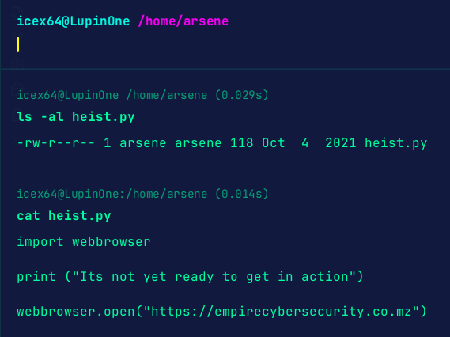

**ip of the machine:- 192.168.122.236**

machine is on!!!

Got two open ports...

Aggressive scan revealed the version of the services as well as one disallowed entry in robots.txt.

oops nothing here.

A message in src. code although.

Got a secret directory, as followed a pattern of the hidden directories.

Got a possible username and a hint to where look for the private key.

Did .FUZZ because it would be hidden and most probably starting with a dot.

So, changed the wordlist and found something.

It looks like some kind of cipher.

Dcode cipher identifier told that it is base58.

Got it!!!

So, user said that this key also has a passphrase, let's crack it using john.

Hash created. Let's crack it.

Found the passphrase and btw used the password list named "fasttrack.txt" because when chose rockyou.txt, it didn't crack the password.

logged in through ssh as the user.

got user flag.

So, saw bash history file and saw "su root", so maybe user has some privileges of root user i guess.

A file....

Oh!!! so we have to do horizontal priv. esc. first.

Saw permissions as well as the code in the file. It mentioned webbrowser module. Let's search for it in the system.

So, found one...

Oh!!! We have got some permissions!!!

So, added a bash shell execution command in the definition of a function which will be called when we execute the file in arsene user's directory.

Got a shell as arsene user. Let's go for root.

Saw note.txt in aresene user's home directory and saw the content and found nothing but it also talked about a secret file. What is it??

Didn't find a file, so did "sudo -l" and can run pip as root user.

So, saw the payload from GTFObins and got root.

