**ip of the machine :- 192.168.122.194**

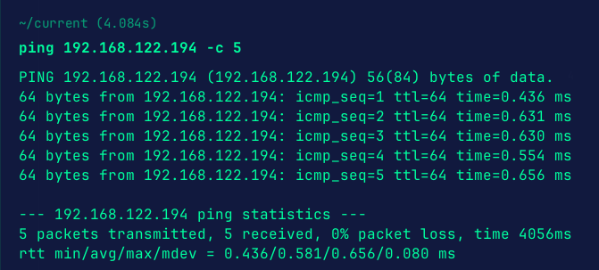
machine is on!!!

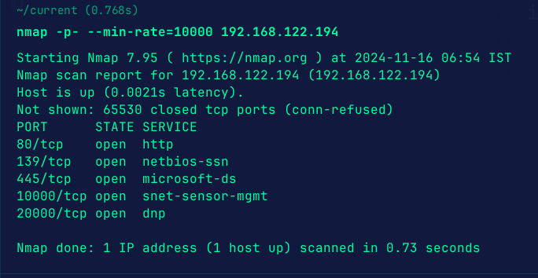
Got some open ports.

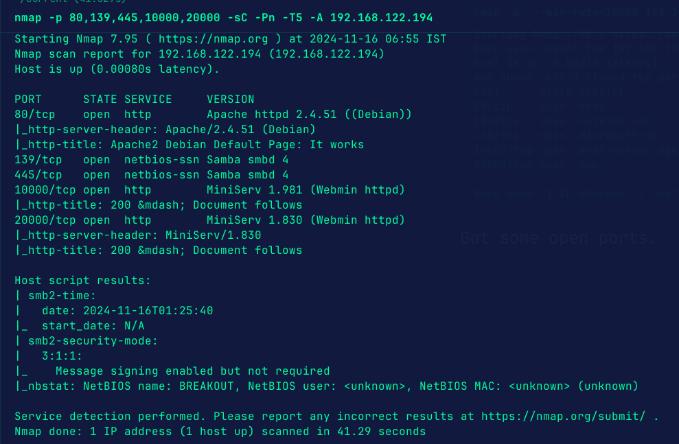
So, found smb, found http running on port 10000 and 20000 and nothing much interesting going on.

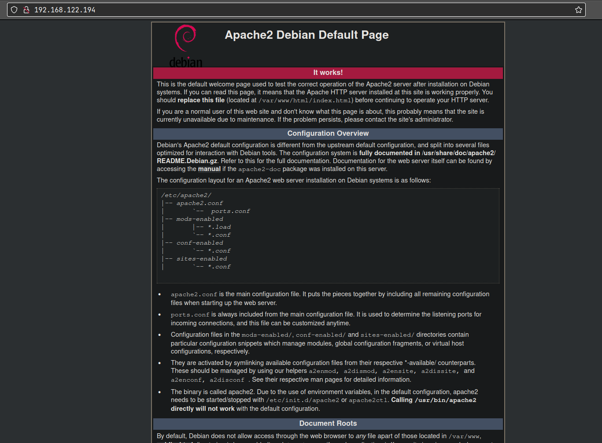
Just the default page.

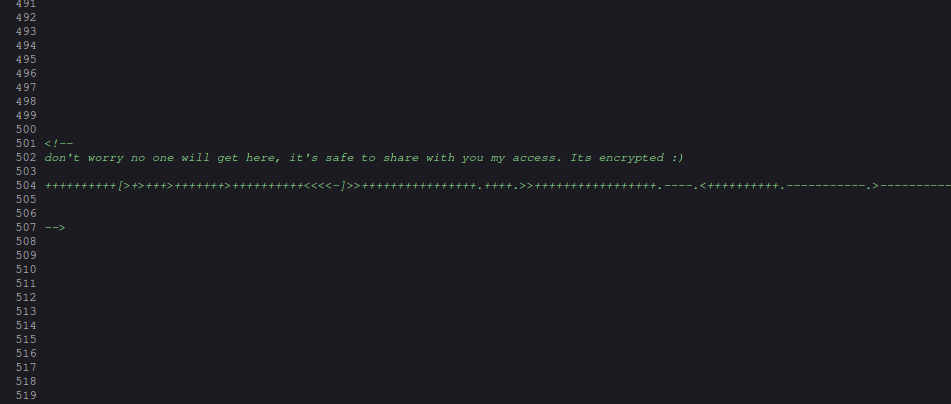
In src. code found some encrypted stuff. Seems like brainfuck to me.

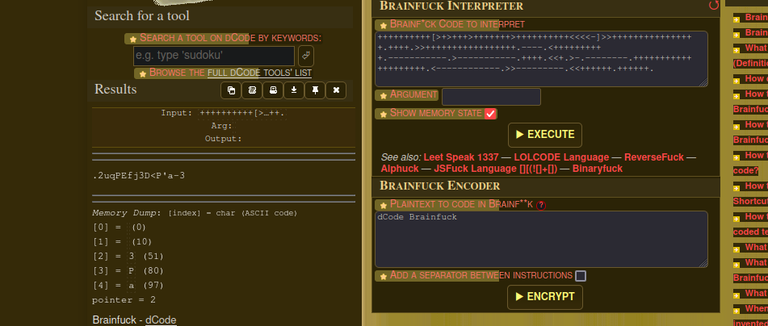
Seems like a password to me.

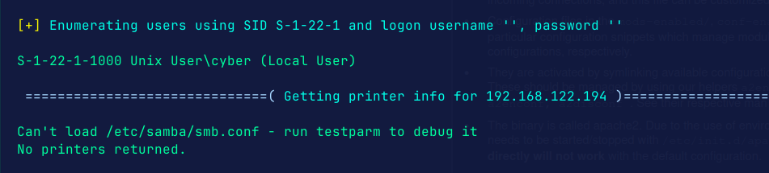
Used enum4linux and found a possible user name "cyber".

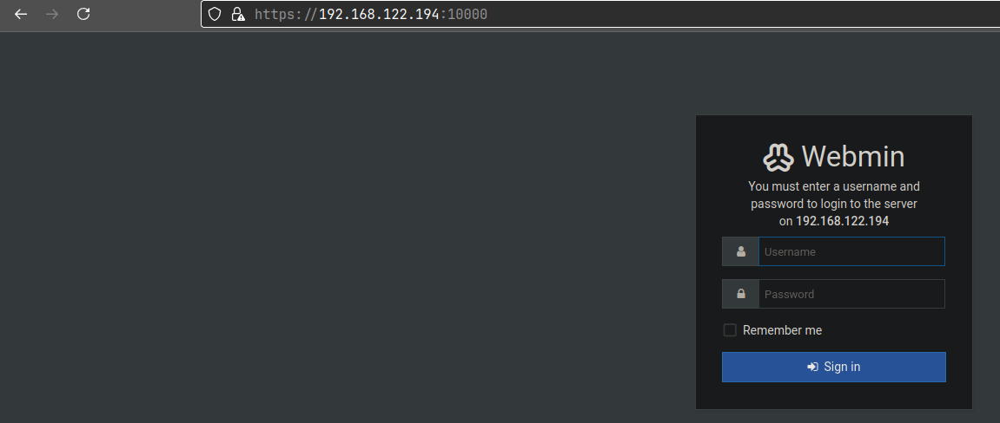
At port 10000 found a login page, let's enter these creds. here.

So, port 20000 is also running webmin, on that it worked but on port 10000 creds. didn't work.

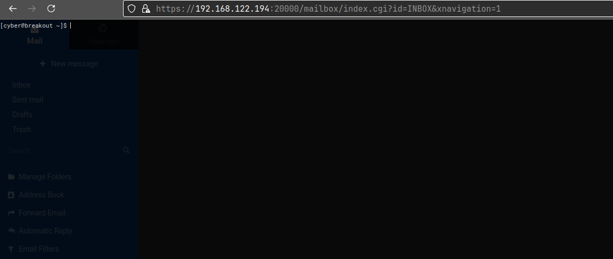
Found a command line panel after logging. 

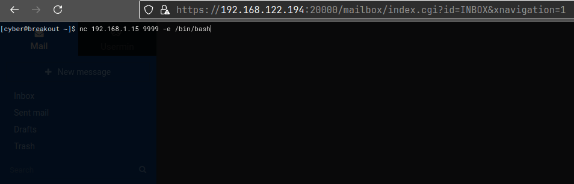
So, added our reverse shell payload.

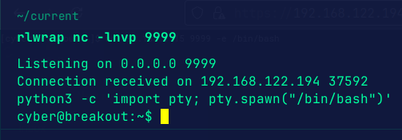
got it!!!

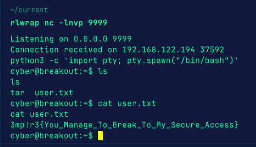
got user flag...

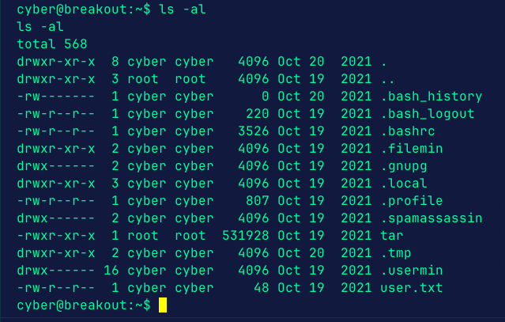
Found a tar binary in user's home directory.

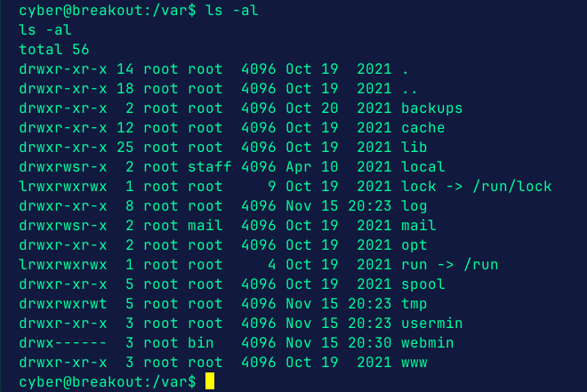
We can read the backups directory which is usually not allowed as it might contain some password. Doing this because found no SUID binaries or users.

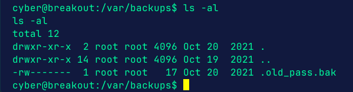
Found a file but cannot read it. Let's use tar then.

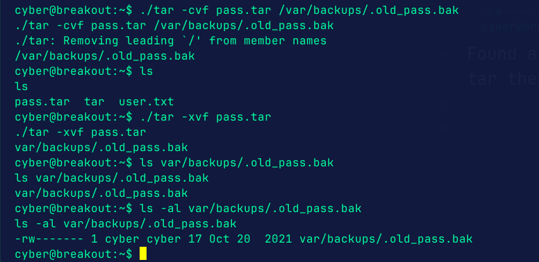
So, we can run tar and compressed the file with tar and then decompressed it and now can access the file as our user.

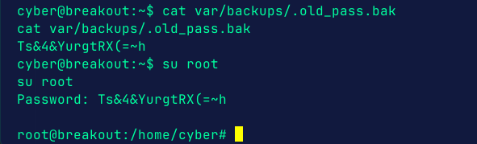
Got root's password.

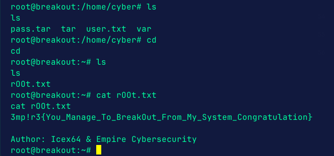
Got it!!!