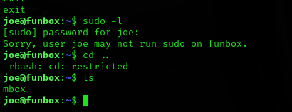

**ip of the machine :- 192.168.122.90**

machine is on!!!

Found some open ports...

Performed an aggressive and found versions as well as one disallowed entry in robots.txt as well as domain to put in /etc/hosts.

Website...

In website footer found that this website is made in wordpress.

Let's explore this directory.

Oh!!!

Just found a bunch of directories of wordpress. Let's use wpscan.

Found two users with wpscan.

So, tried to brute force the ftp service and found the password.

Found a file, let's view it.

Oh!!!

Tried the same creds. and got initial access to the web server through ssh.

rbash restricted. Let's try to escape it.

So, came across a blog and escaped the shell.

So, found a .tar in user funny's home directory and a .backup.sh which is compressing the /var/www/html directory. So, got the html.tar in my system and extracted it. Let's see what it contains.

In, wp-config.php file got creds. to the database.

So, creds. didn't work. But we can edit  .backup.sh file.

So, added a rev. shell payload in the file.

It was a cron job so got the shell.

So, i read a person's writeup and he said that the cron job is running as both root as well as the user, so got root.

Got it!!!