**ip of the machine :- 192.168.122.96**

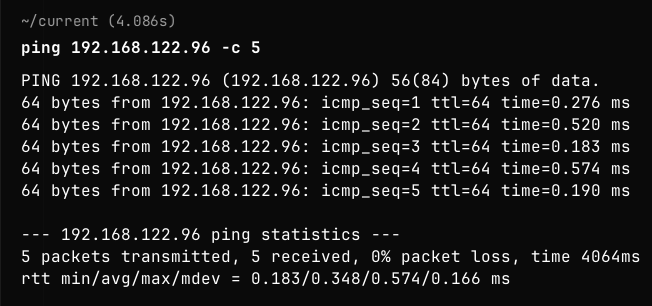
machine is on!!!

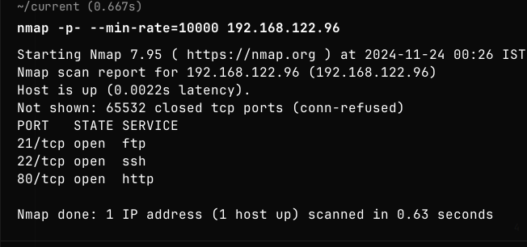
Found some open ports.

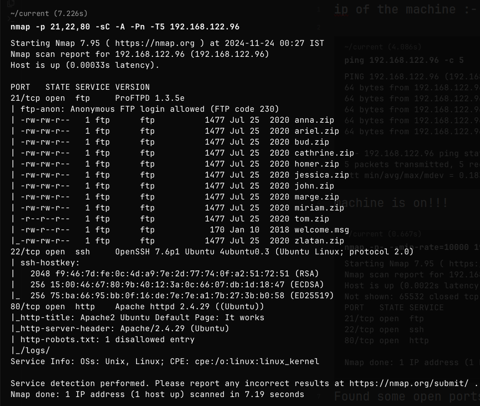
Found versions of the services running as well as anonymous login allowed on the ftp service.

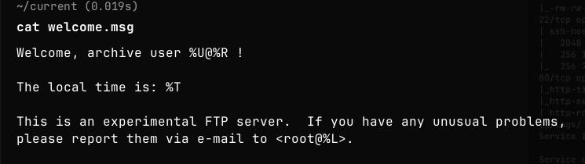
Also got a message, along with many zip files.

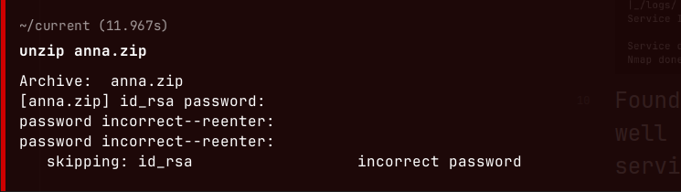
So, tried to unzip one and came to know that they might contain ssh private key.

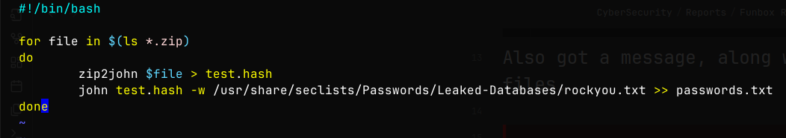
So, wrote a basic script to actually get hash of each zip and then crack it using john.

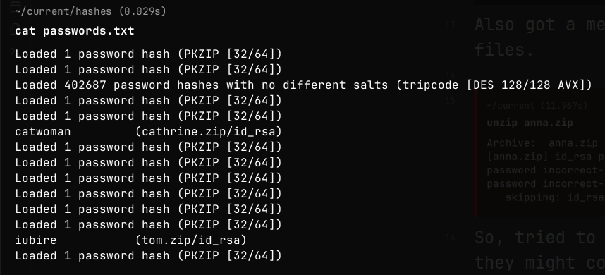
Got password of the zip of two users.

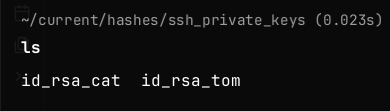
So, got two private keys.

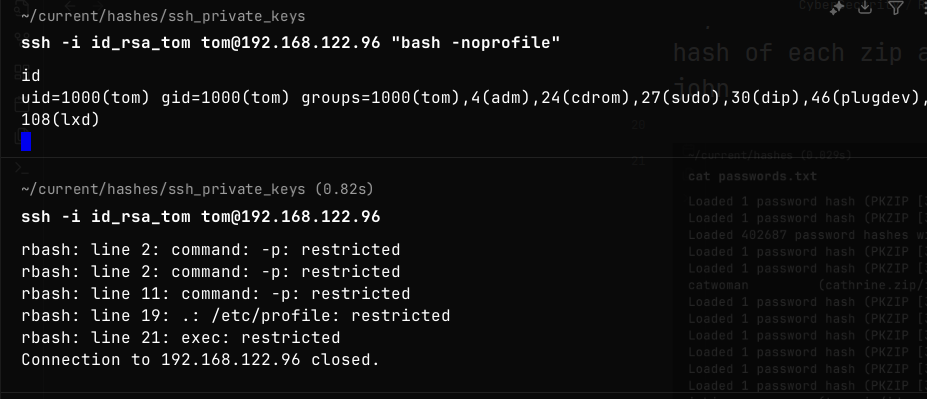
So, tried to login with ssh key of tom and it was showing restricted shell, so at least got a bash shell using "bash -noprofile".

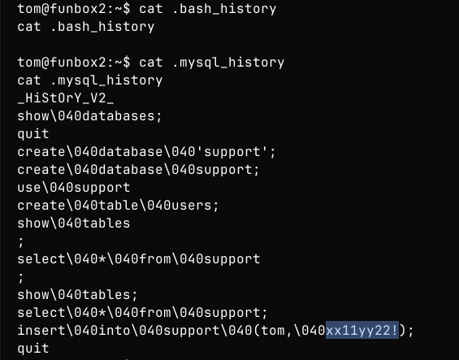
Saw in user tom's home directory found bash history and mysql history files and then after viewing them found the password of user tom.

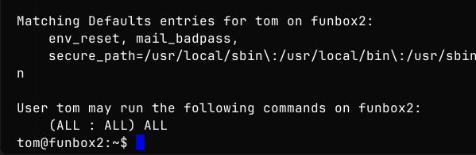
User Tom can run everything.

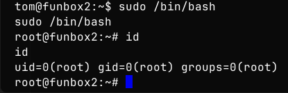
Got root.

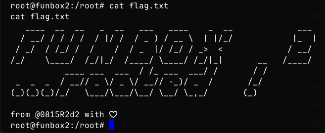
Got root flag.