**ip address of the machine :- 192.168.110.235**

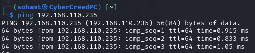
pinging the machine to see whether machine is running or not.

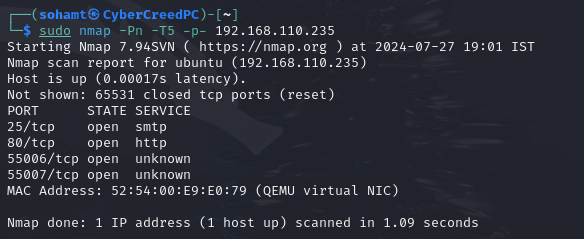
After running an nmap scan we found that only 4 ports are open out of all.

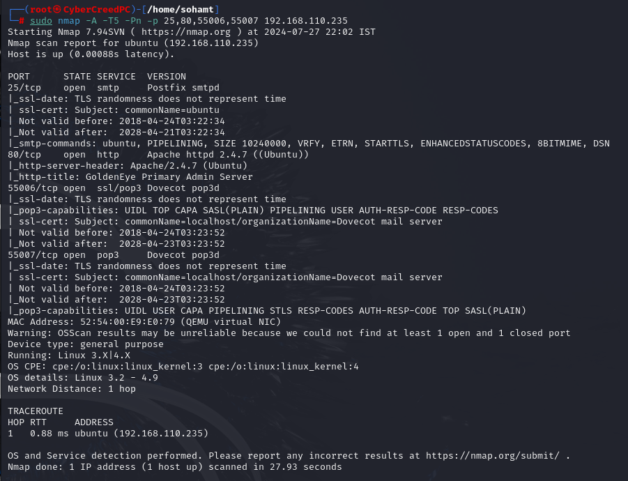
Did a script scan like versioning and os detection. So, 55006 and 55007 is running POP (Post Office Protocol) as a service. There are also some command listed which we can use in the nmap scan.

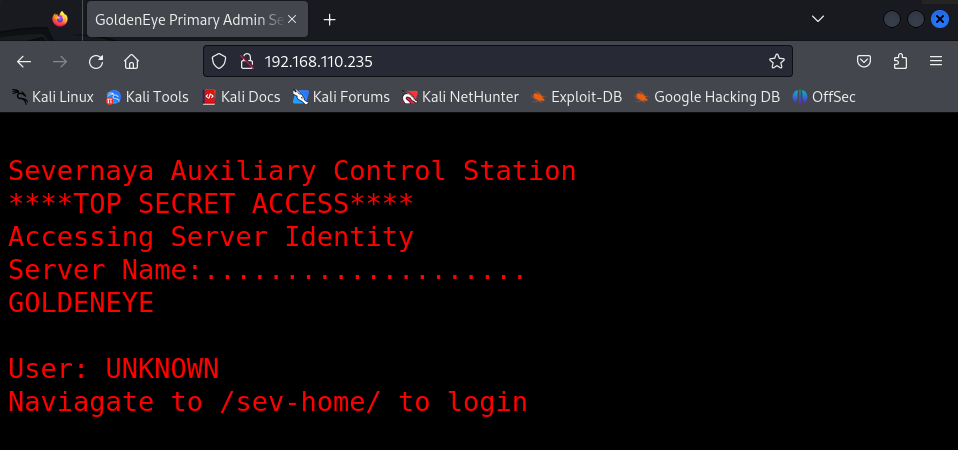
it was running web server so went to the website just to see it. Now will run gobuster and nikto further to gather more information.

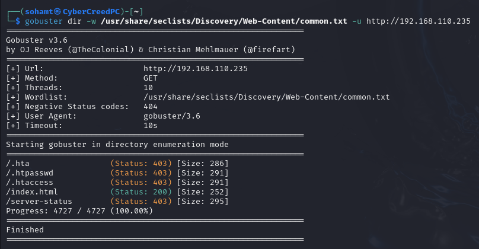
didn't find anything interesting in the results of gobuster.

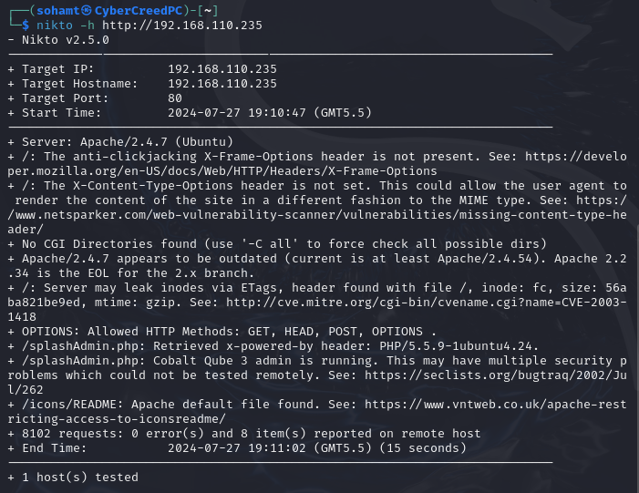
**Apache outdated** server is running, **"cobalt qube 3"** is running on **splashadmin.php**, **apache default file found** and nothing else from nikto.

Now let's go to the website and start inspecting source code manually.
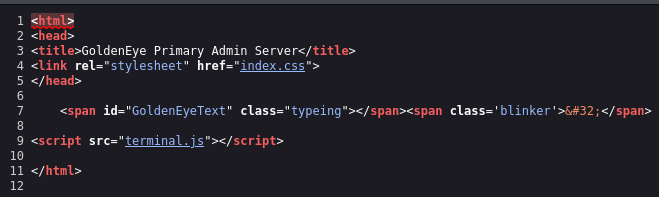
terminal.js file might contain something interesting.

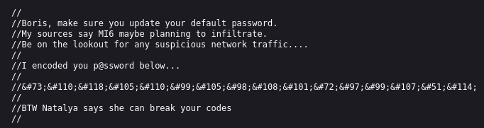
In terminal.js saw some comments, and came to know that user name "Boris" has a password and is encoded below so will now try to decode the password. "natalya" is also a possible user name but with no password. 

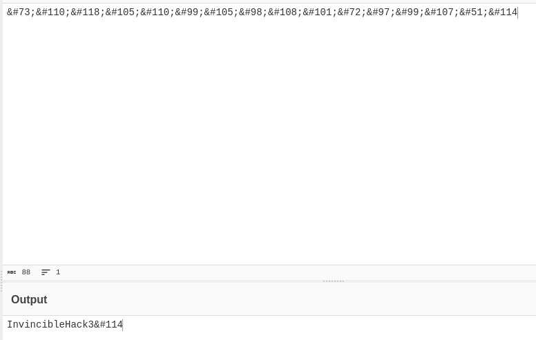
went on cyberchef.io and it decoded it from a form known as **"HTML Entity"** But password was wrong so used burpsuite decoder to verify it and then got right password.
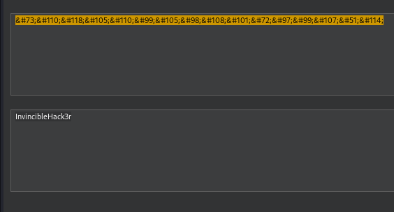

possible username:password found
boris:InvincibleHack3r

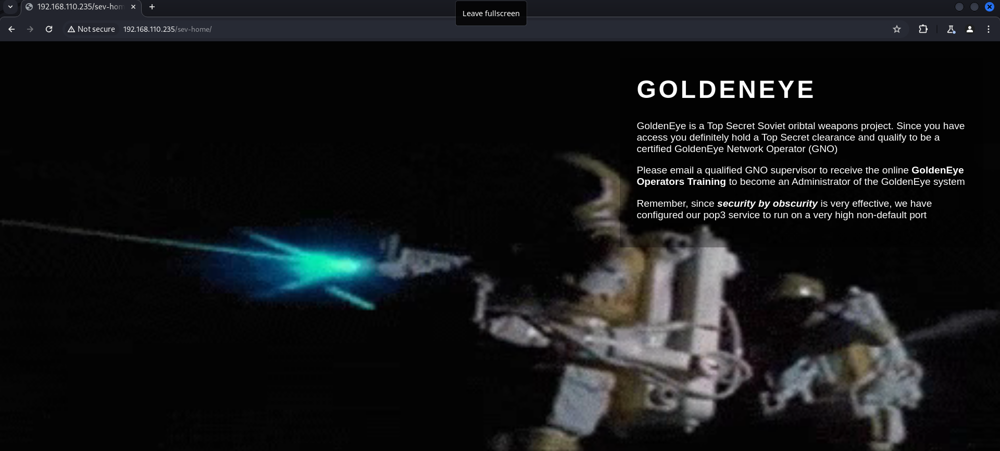
We were able to login with above username and password and was able to access all videos and photos on the website.

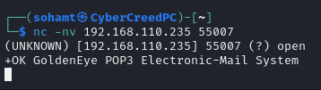
So was unable to further get anything about the website through gobuster, nikto and seeing source code. But they gave hint about POP3 and we know that they are running POP3 on unknown ports known as 55006 and 55007 and 55006 is running POP3 with SSL and 55007 is running POP3 without SSL so we tried to connect to POP3 service directly through netcat.

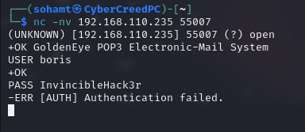
we failed in authentication which "boris" is not reusing password. So now, we have to brute force the password using hydra.

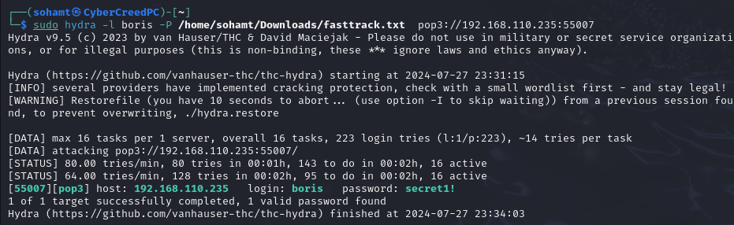
got pop3 service password of boris.

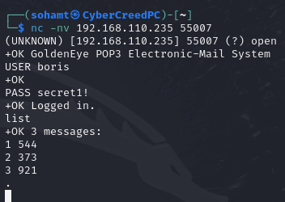
We logged in as boris and can see he has 3 mails. Let's see them.

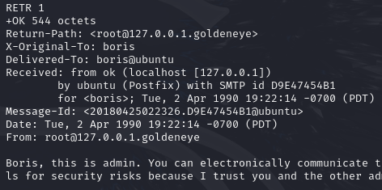
First was from root.

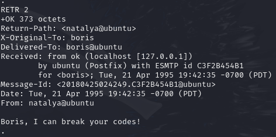
Second from natalya which is again a possible username.

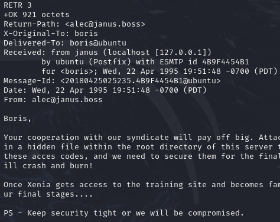
Third from Janus.

Natalya is also an employee like boris so let's try to crack her password as well to see if we can find something interesting in mails or not.

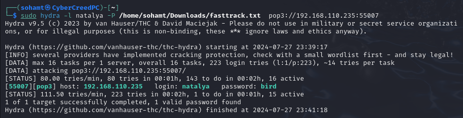
Found natalya's password as well.

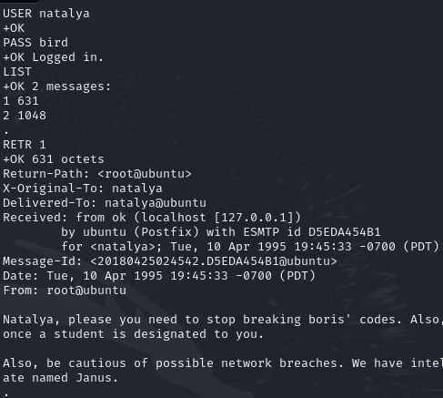
Didn't find anything interesting in her first email.

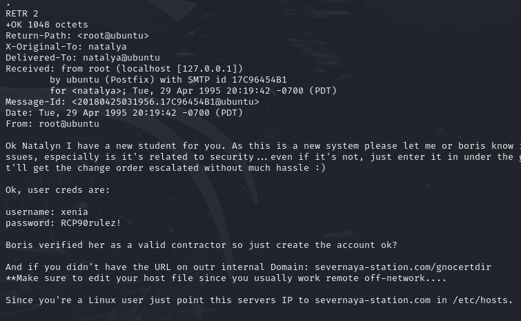
But in second some interesting creds. and a domain. Let's enumerate and test further now.

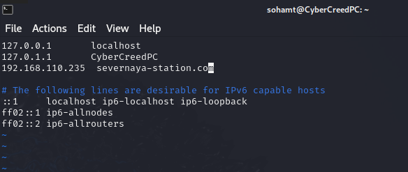
add domain and goldeneye machine ip to /etc/hosts file.

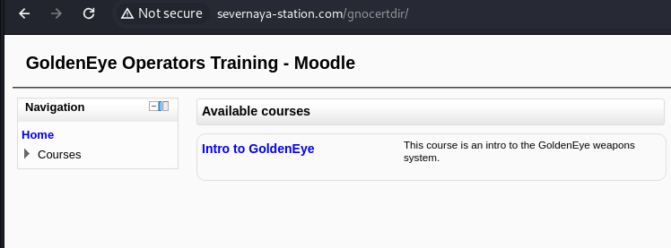
This will open after going to the provided domain in email address.

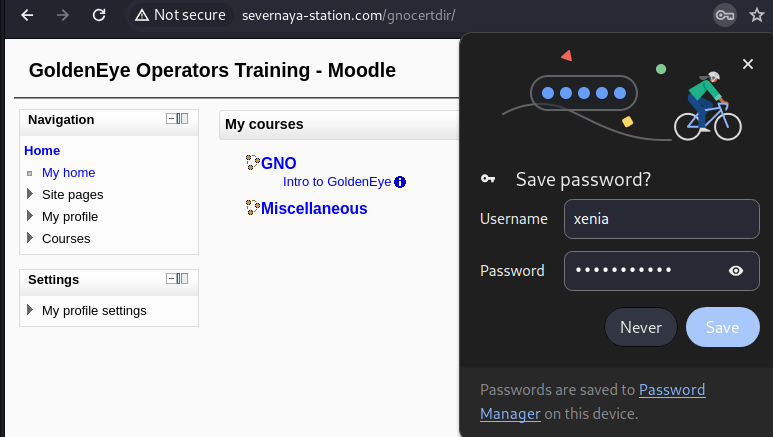
was able to login on platform using creds.

Exploring account
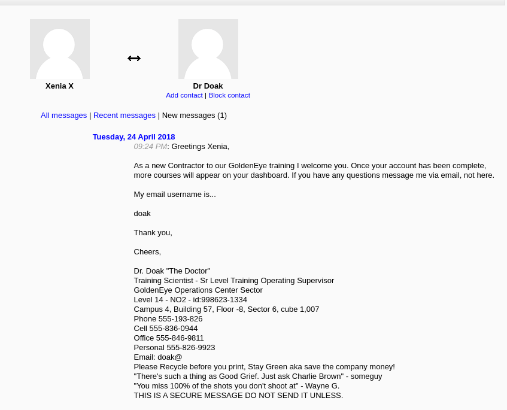
Found this message from Dr.Doak. We got his username, so may be he also uses pop3 service and has some interesting mails over there so let's brute force his password as well.

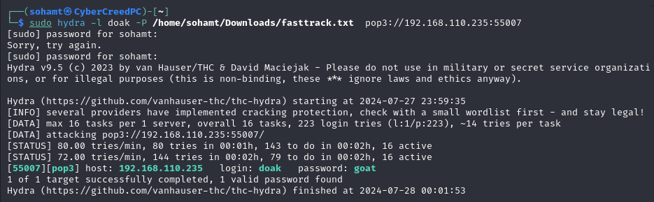
Found creds. of doak.

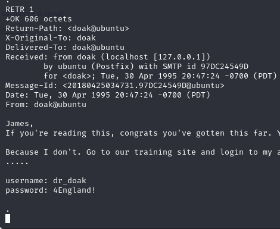
Found an email and found creds to moodle platform for Dr. Doak.

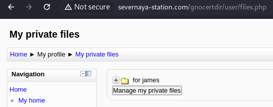
found something in private file of Dr. Doak

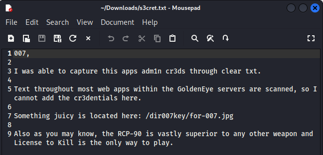
Found a file there and this is its content.

did strings on the image and found some creds.
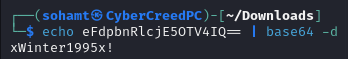
In s3cret.txt they captured admin creds so may be they are admin creds.

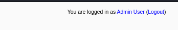
so able to logged in as admin with above password on moodle.

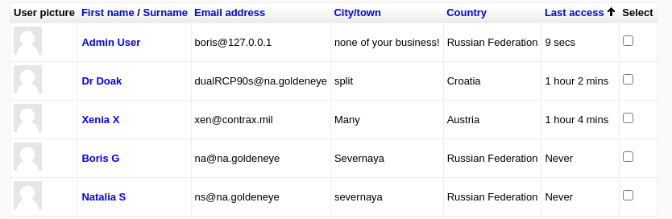
we also found some other users as well on moodle. Now we will start investigating all the options in the admin's room.

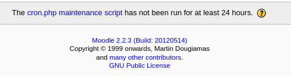
In site administration -> Notifications we found that moodle is running 2.2.3 version let's see if it has some known exploits which can help us gain reverse shell.

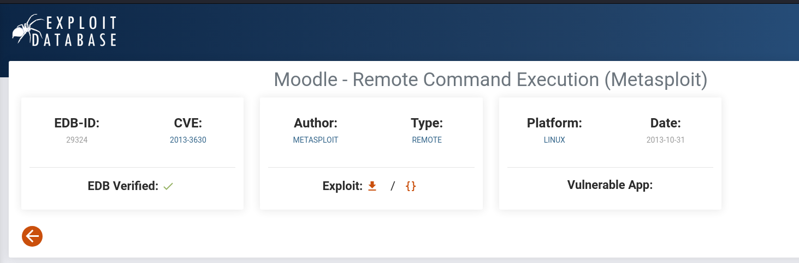
saw this exploit on exploitdb and understood the comments and code and then saw that if i convert spell checker to PSpellShell and then change it's path in system settings to a payload to get reverse shell.

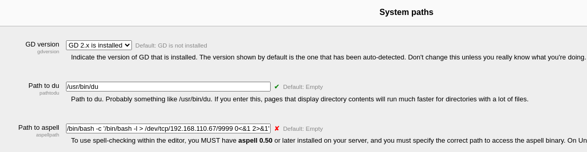
add this payload in path to aspell.

go to site pages and site blogs and enter anything and click spellchecker to get reverse shell.
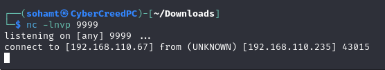
got reverse shell!!!!

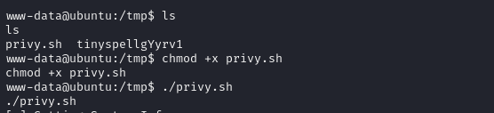
running privy.sh script to get some knowledge about the system. 

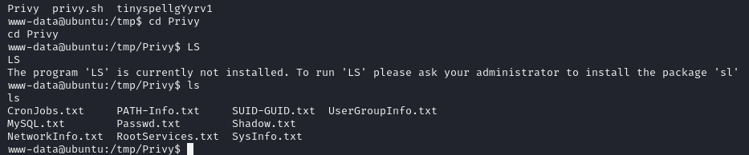
let's inspect each file.

from cronjobs file didn't find anything interesting.
from mysql find didn't find anything to escalate privileges.
in network info file port 5432 is open but why?
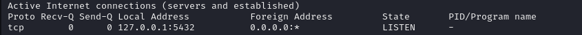
in PathInfo.txt found nothing.
in Passwd.txt, root and postgres are running bash.
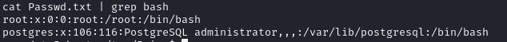
in RootServices file didn't find anything weird.
in SUID-GUID found a file by name .htaccess in moodledata directory. No SUID and GUID binary worked for priv esc from GTFObins.
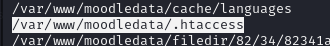
in Shadow.txt found nothing.
in SysInfo.txt, found some info about versioning and kernel version etc but nothing worthwhile.
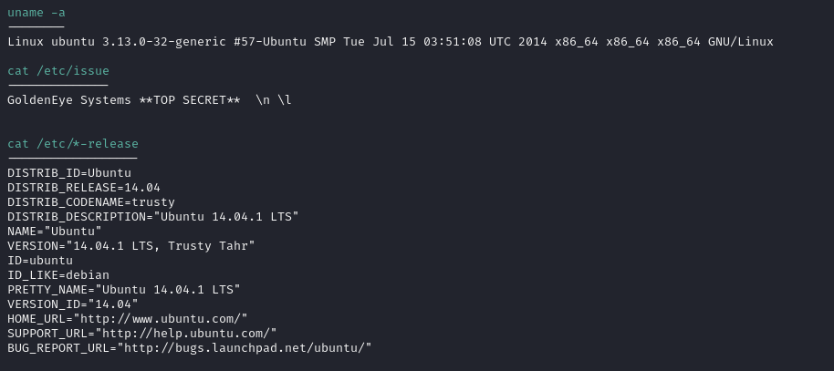
in UserGroupInfo file, got some info, which are files in all the user's home directory.
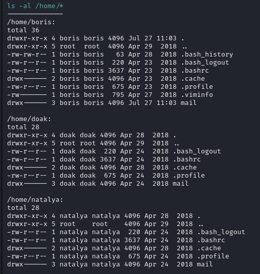

Now if we didn't find any flaw/vulnerability that can help us escalate privileges so we have to search for kernel exploits or see whether kernel has any problems or not.
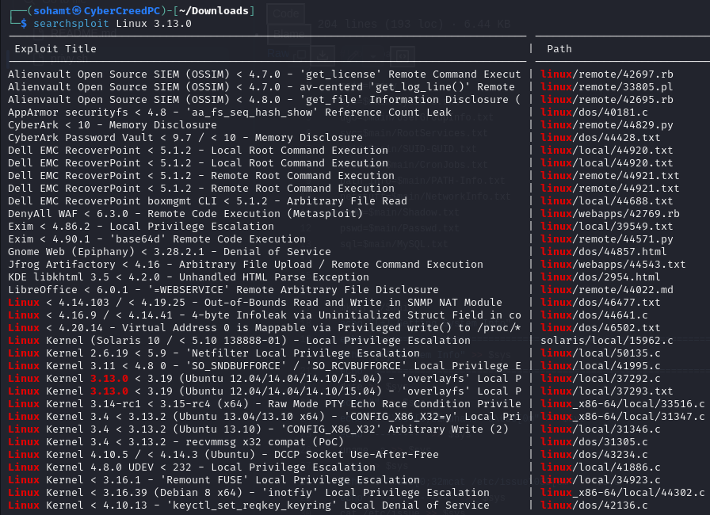
Got a lot of searches on searchsploit.

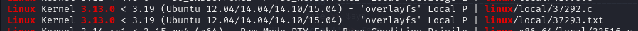
got almost two exact matches. Now, let's decide which one to use.

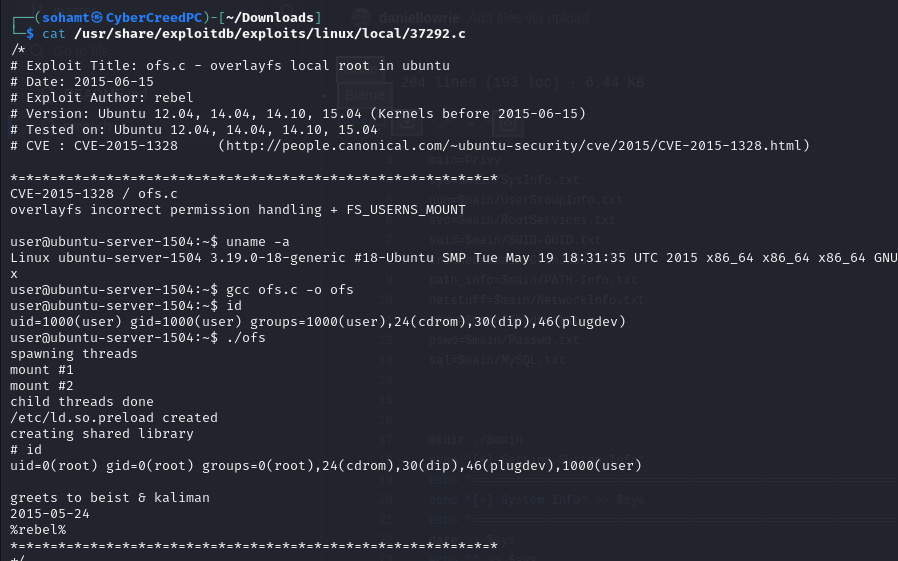
So will be using 37292.c.

to run this exploit change gcc to cc so it will call cc compiler to run instead of gcc because gcc doesn't exit in machine.

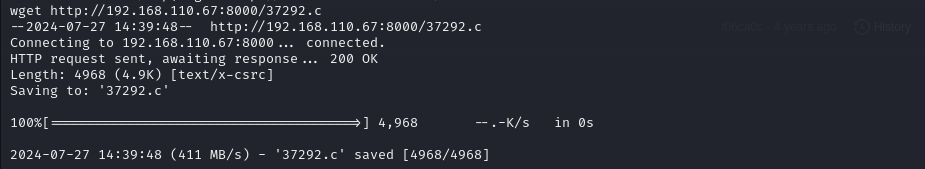
Downloaded exploit on target machine. Now do "cc 37292.c -o exploit.c" and then simply run the executable.

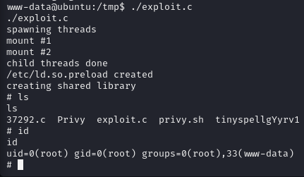
Here, we got the root access. Finally, escalated privileges.

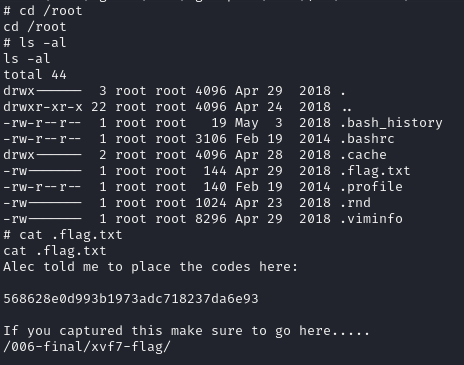
So, here we have got the flag..............