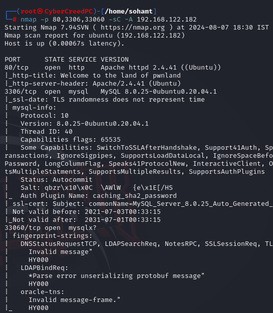

**ip address of the machine : - 192.168.122.182

machine's up!!

ports running.

versioning info. Now will be running gobuster and nikto first.

found this in jumbled stuff for port 33060.

just got some directories.

Now we will enumerate the web manually.

found this main.js file.

going to the url and found this login form.

went to seedDMS github repo and learned about the structure and got to know about settings.xml file.

in settings to xml file got some creds.

was able to login with creds.

got a possible username...

got password hash for the admin.

password hash is md5 and we can modify database so let's change password according to ourselves.

so set the password to 'admin' and generated md5hash is then updated in the table and then we were able to login as the admin.

Now let's inspect the website to see where we can add the reverse shell.

added file and now we will redirect to a url to gain a reverse shell.

we got creds. of the user mentioned.

version of kernel (in case had to use kernel exploit for local priv esc)

so here we are login 

thus escalated privileges, as "saket" user can run all commands so shifted to sudo.