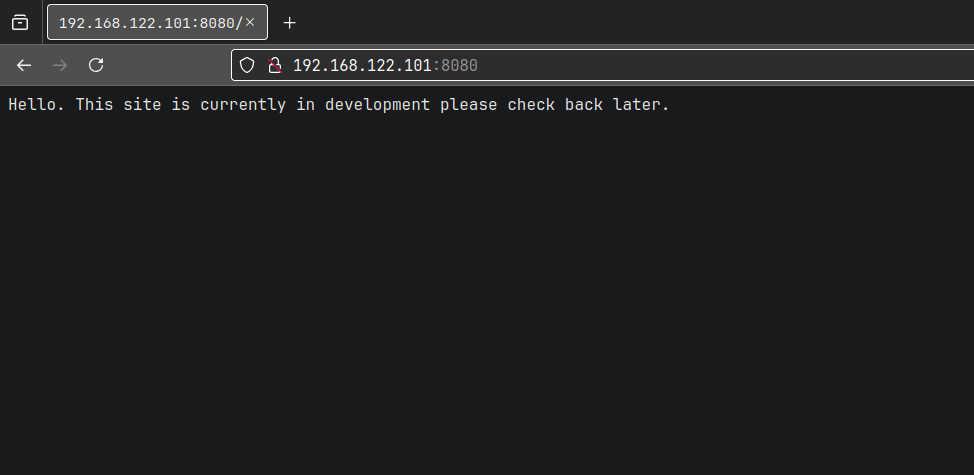
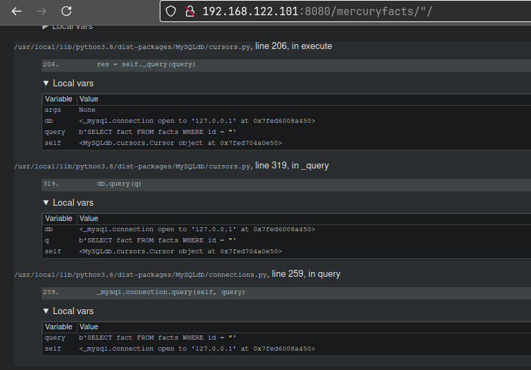
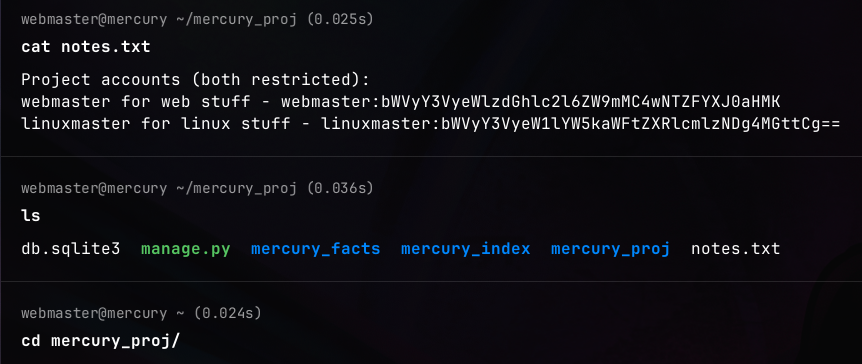

**ip of the machine :- 192.168.122.101**

machine is on!!!

Only two open ports!!!

Performed an aggressive scan and found one disallowed entry in robots.txt.

Nothing on the web page. Let's check the src. code.

Nothing at all.

Nothing interesting in robots.txt as well.

Found nothing in web directory fuzzing as well.

Found nothing by feroxbuster as well.

So, went to one of the blogs by hacktricks and learned that /console directory is sometimes accessible when we want to debug the web application in wsgiserver.

It showed an error of django and saw one hidden directory which was not displayed earlier anywhere.

So, visited the directory and found this web page.

Found this and nothing interesting.

Also found a todo list. So now it is confirmed that django is being used at back end in the web application.

Got a bunch of errors after visiting this web page and got the version of django running but found only one thing SQL injection.

So, saw some errors and i think sql injection is possible on this web application but where, let's find. I also searched that this version of django is actually vulnerable to SQL injection, so let's try.

So, at this web page it was 1, so what if i do it 0.

If it was a web page, it should have shown error but nah!!! So, let's try the most basic SQL payload here.

Oh!!! It worked.

So, got tables names for information_schema.

So, from users table, got a possible username.

Also got passwords.

So, logged in as webmaster user.

Got user flag.

So, there was a directory in user webmaster's home directory, so went to the directory and found a notes.txt with some creds. in it which are base64 encoded.

So, got it. So 'linuxmaster' user was not showing when we did sql injection so let's login as 'linuxmaster'.

Logged in.....

Found nothing in linuxmaster's home directory.

So, user linuxmaster can run a bash script as root user but what is SETENV???

So, searched for it, maybe it means that when executing a command or something we can set our own environment variables and values assign to it. Let's see the script then.

So, the script is calling tail but full path is not specified. But when called the script it is showing only last 10 lines of the file, so we cannot use priv. esc. method of less. But path injection seems possible.

So, tried creating a symlink of tail with /usr/bin/bash such that when the script is ran as root user we can get a bash shell but it didn't work.

So, user linuxmaster can also run vim, so trying with vim now.

We got a new file in vim. It means that it worked.

So, let's try this payload now.

Got root as well as the root flag.