**ip address of the machine = 192.168.122.176**

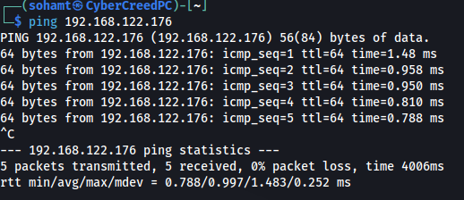
First Pinged the machine to see whether machine is up or not.

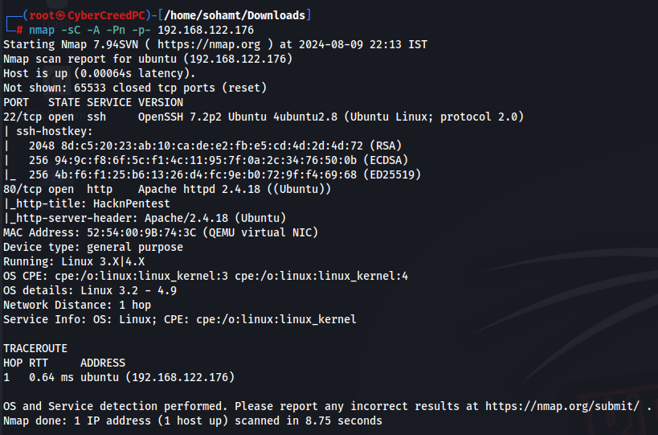
Did a service scan directly on all the ports of the machine.

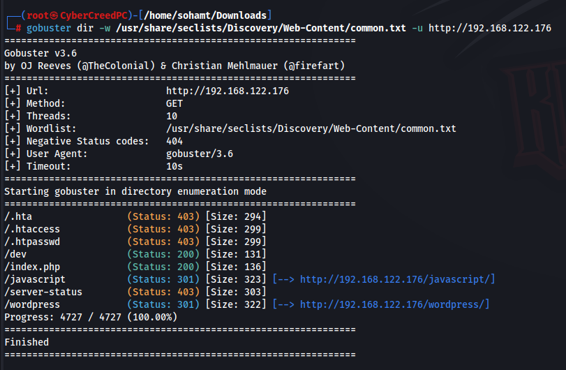
Used gobuster for directory fuzzing and learned about some of the directories we can explore during manual web app enumeration.

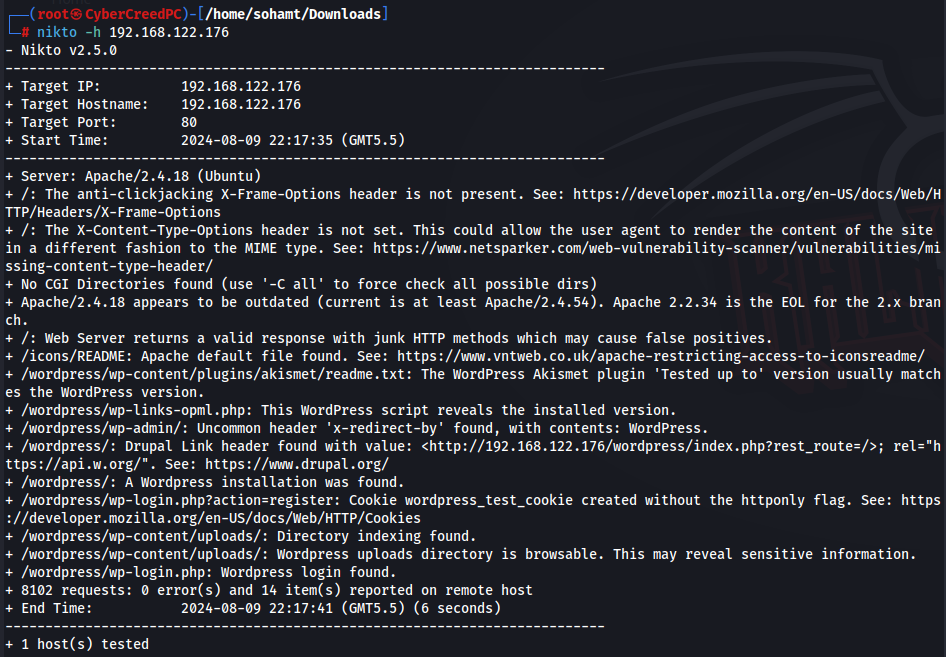
Running nikto told about some more directories and also told that wordpress is being used here.

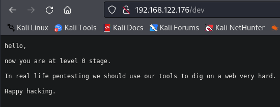
In one file got a small message and any other directory and file is of no use right now.

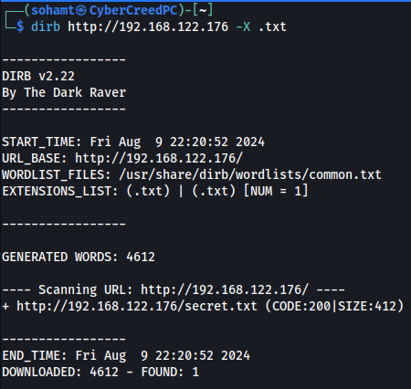
It told us to dig deep so we used dirb and -X to specify the extension of files which we want to find and we went for .txt only because to get any further hint and credentials .txt files are what we want to look for.

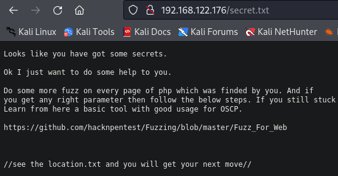
This file is hinting towards a github repo to find another file.

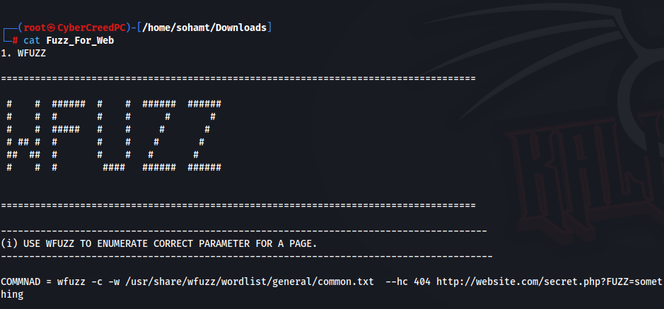
Basically it is telling us about the tool which we can use for further fuzzing of directories. So basically trying all the options in it to find what we can get.

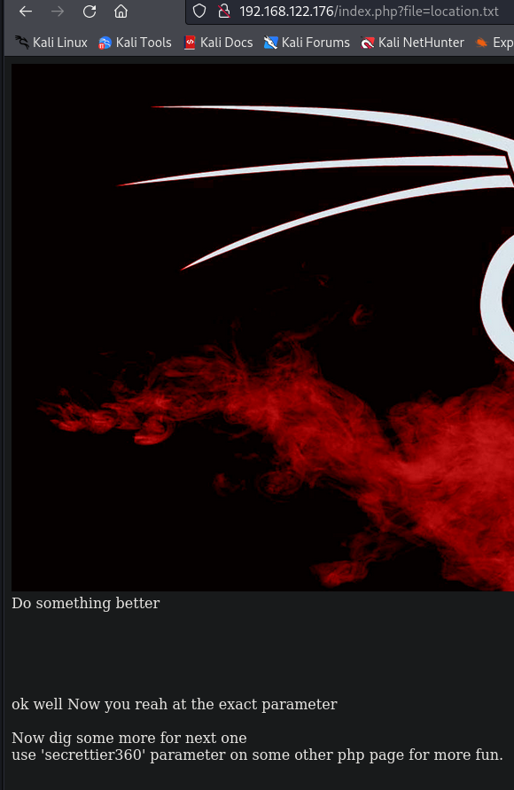
So in one of the options in wfuzz a query was done in index.php file for enumeration so did that by modifying the url of the webpage and hinted to use another parameter and that to on another php page. So now we have to another webpage so we have to do gobuster scans on each directory we found.

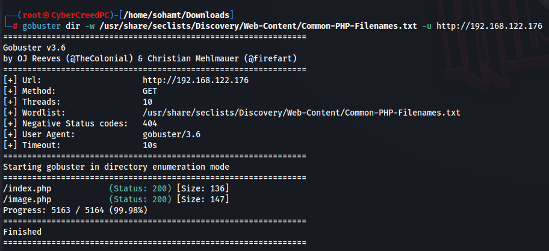
So did another gobuster scan but this time of common php filenames and we know that we have to query on image.php web page now.

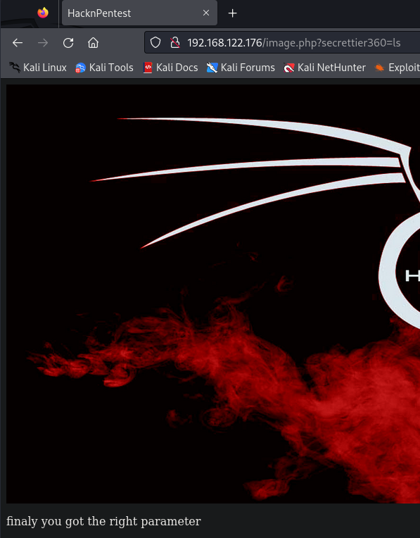
I tried to use a basic OS command and it told that we are using the right parameter.

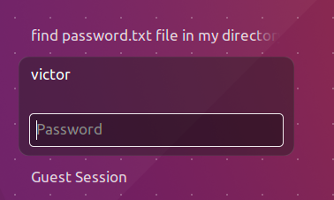
When we opened the machine we got a possible username named "victor", so let's see if we can see passwd file.

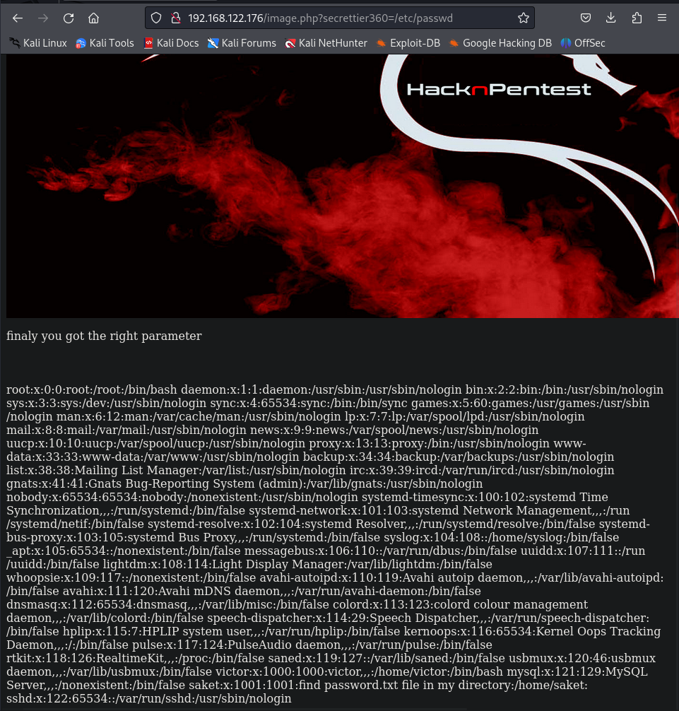
We can see in second last line there is a user named saket and saying to see password.txt file in his home directory.

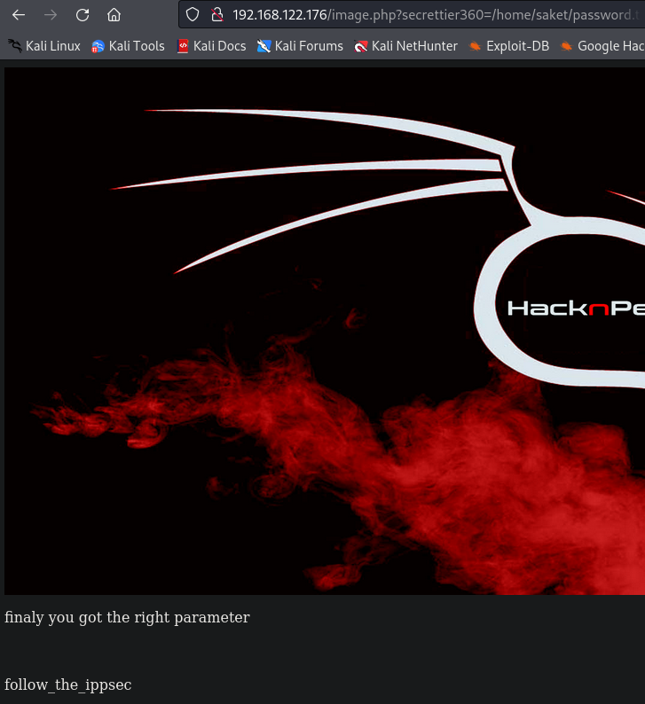
got a password "follow_the_ippsec"

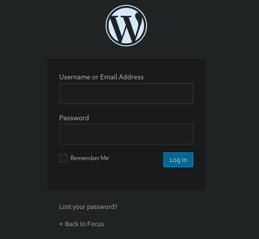
Now we have a login page at /wordpress/wp-login.php
Let's enter creds....  victor:follow_the_ippsec  to see if we can login or not.

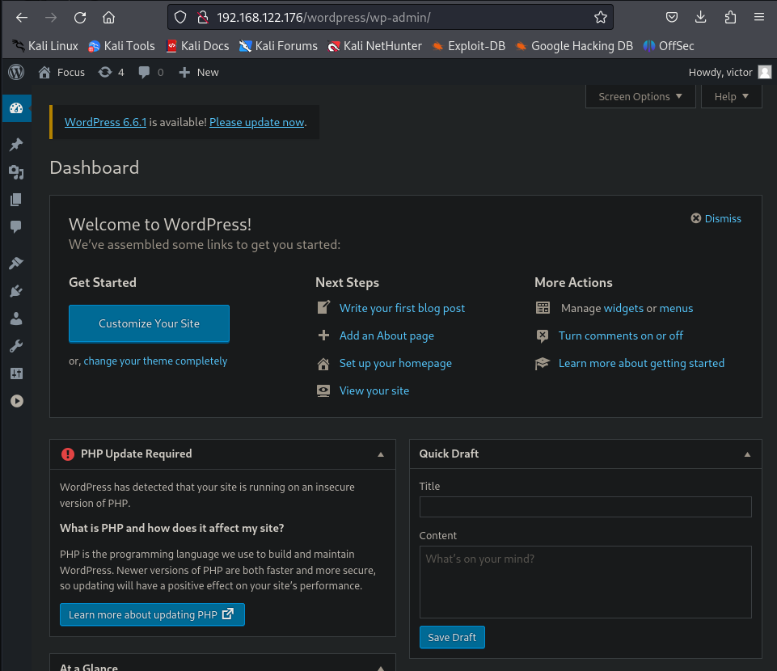
Now let's see from where we can get reverse shell.

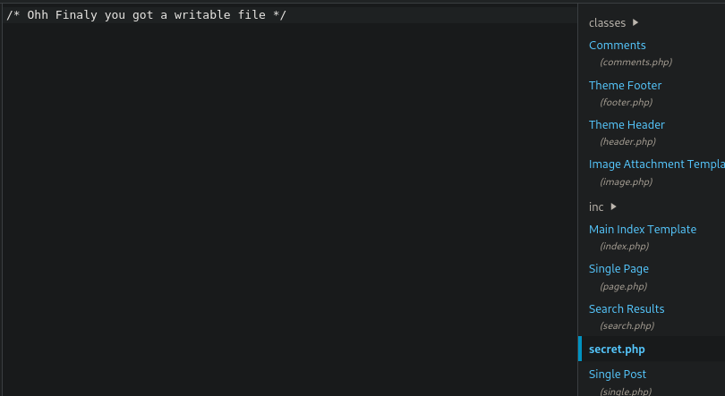
Ohh finally got a file where we add our reverse shell code to get a reverse shell.

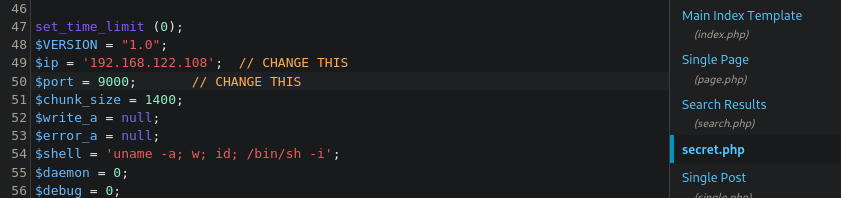
Added our ip and port for reverse shell using netcat.

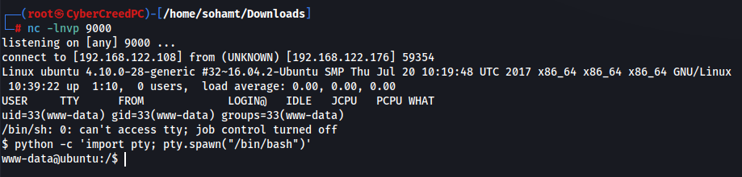
Now after saving the file navigate to /wordpress/wp-content/themes/twentynineteen/secret.php to invoke the shell.

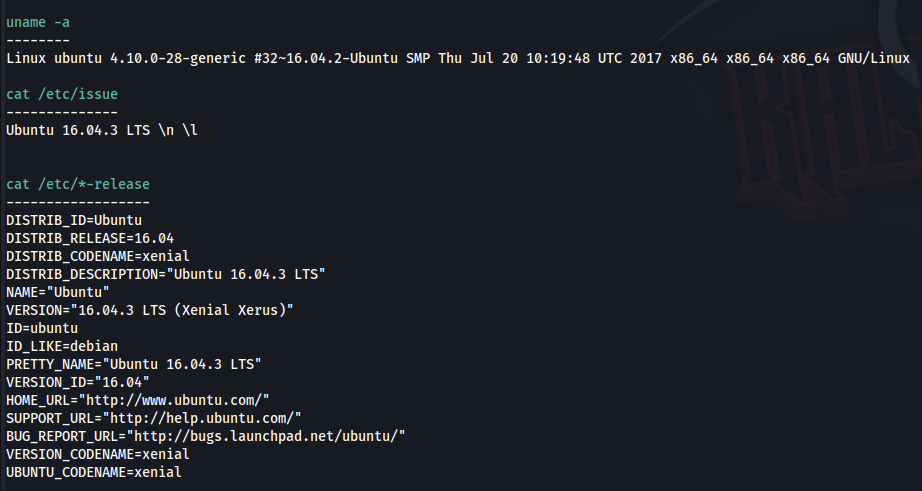
Found out kernel version and OS so that can do priv esc using kernel exploitation.

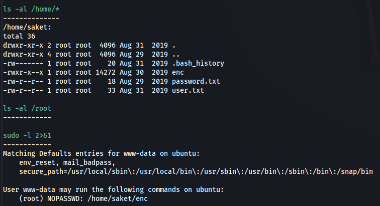
Let's see what we can view.

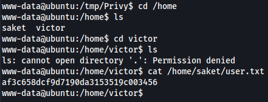
So we cannot access victor's home directory but viewed a file named user.txt in saket's homr directory and got a flag.

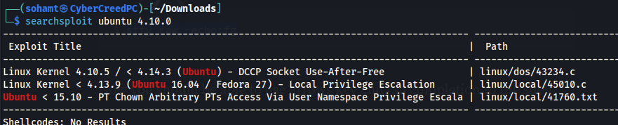
I used to searchsploit to see if we can get any available exploits to escalate privileges. Will be using 2nd one.

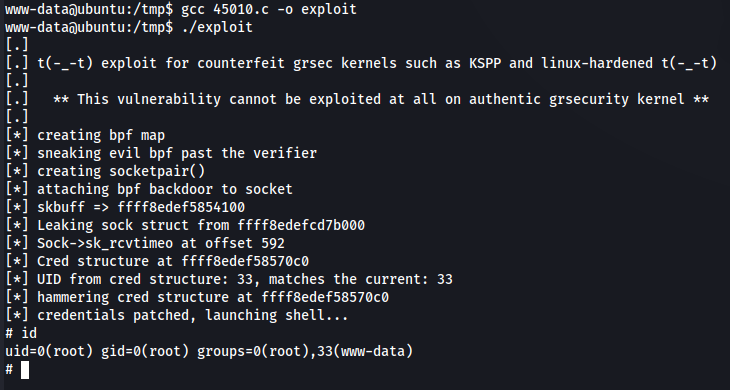
Finally escalated privileges.

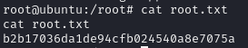
Finally got the root flag...................