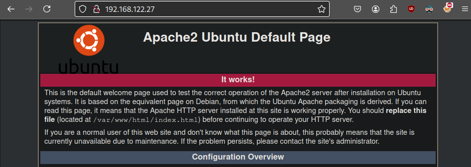
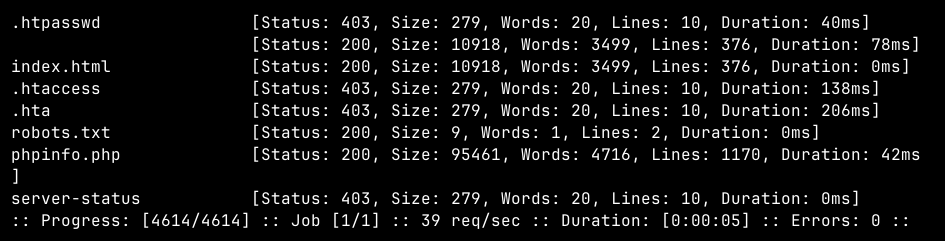
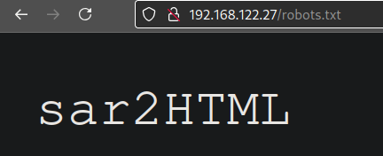

**ip of the machine :- 192.168.122.27**

machine is on!!!

Found one open port.

Performed an aggressive scan to get the version of web server running on port 80.

Just the default apache page.

Found some directories and files during directory fuzzing.

Got the name of another directory in robots.txt file.

So, sar2html is a service that is running on this web server.

Also got the version that is running. Let's see if there are any exploits available for this version.

Got a way to get initial access to the server.

Let's try to use it!!!

So, it said we have to add ";<command_>" in order to execute commands, so trying id.

Ok!!! it worked. Let's try to get reverse shell.

So, added the reverse shell payload, but it won't execute like this. We have to url encode the payload.

URL encoded the payload.

Got reverse shell...

Found nothing imp. in the directory in which reverse shelld.

But in /var/www/html found two scripts with permissions. Let's view them.

Ok!!! So, here in finally.sh which can only be executed as well as read and write by the root user is executing a file write.sh and write.sh is the file that we can edit as the current reverse shelld user. Let's see if finally.sh is even running as a cron or not using pspy.

So, went to /etc/crontab file to see whether the script will be executed as a cron job or not as it was not showing in pspy then came to know that it does run after every 5 minutes!!!

So, added a reverse shell payload in write.sh.

Now, let's wait upto 5 minutes with our listener.

Got user flag in user's home directory.

Also got root flag after getting reverse shell.