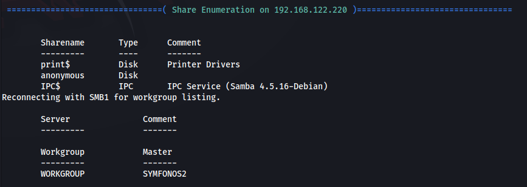

**ip address if the machine :- 192.168.122.220**

machine is on!!!!

open ports!!!!!

did a script scan!!!

found some shares using enum4linux.

found log.txt file and opening it in mousepad.

it's the samba configuration file.

just re installed the machine and new ip is 
**192.168.122.11**

found password hashes.

found password for the user.

found librems.conf file file and seeing that it is running at localhost on the machine.

port forwarding 8080 of the machine to our local host port 8181.

opened it on 8181 and got a login page.

was able to login using creds. of aeolus.

will be using metasploit for further exploitation.

will be using 1.

set options and enter exploit and gained a reverse shell.

did sudo -l and saw that the user can run only one command mysql.

went to GTFObins and escalated privileges.

got it............................