**ip address of the machine :- 192.168.122.232**

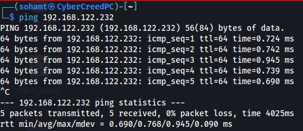
machine is on!!!!!

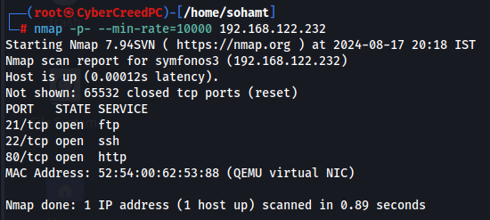
will be performing versioning now.

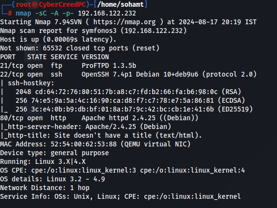
Found version of the services currently running on the ports.

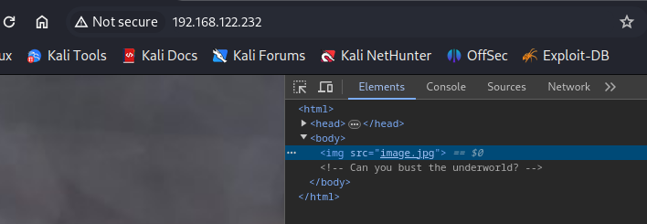
inspected the web page and found something in comments of the source code ("underworld")

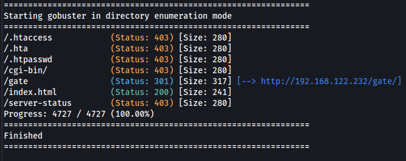
oops!! found a directory, let's visit it and see what we can find further.

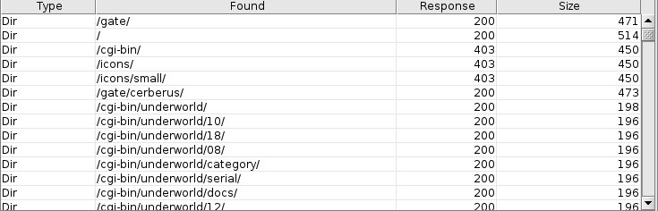
using dirbuster found a web page /cgi-bin/underworld/

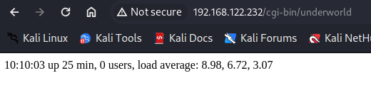
showing uptime on a web page.

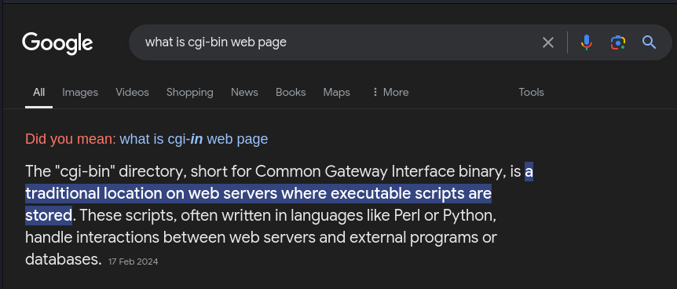
found this that cgi-bin is a folder where executables are stored and maybe underworld web page is an executable showing "uptime" 
command.

with some searches found out that it is a "shellshock" vulnerability which allows attacker to execute a script remotely via bash shell.

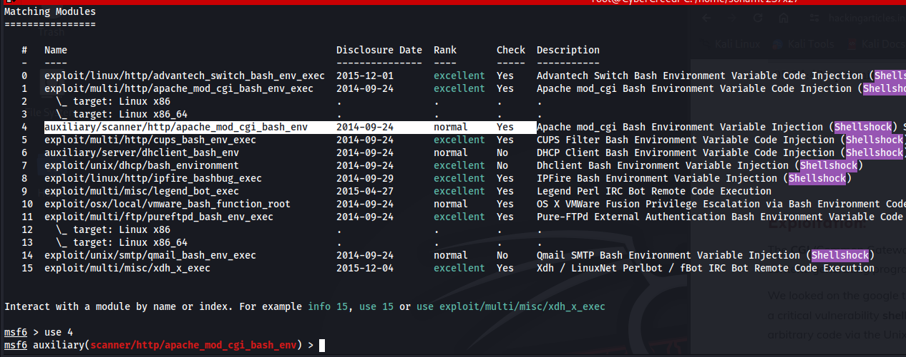
got an exploit in metasploit.

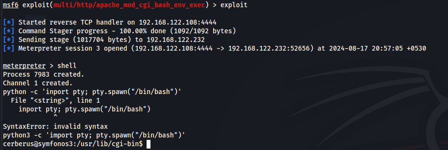
got a shell and created a meterpreter session.

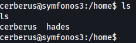
while finding things manually found out that there are two users which means we have to go for horizontal privilege escalation first.

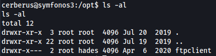
also found that in /opt directory there is an ftpclient directory which means that an ftpclient is running so let's capture that traffic on local interface.

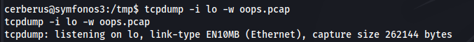
capturing traffic on local interface to see if a user login into the ftp server as ftp server is not secure to access so maybe we are able to capture something useful.

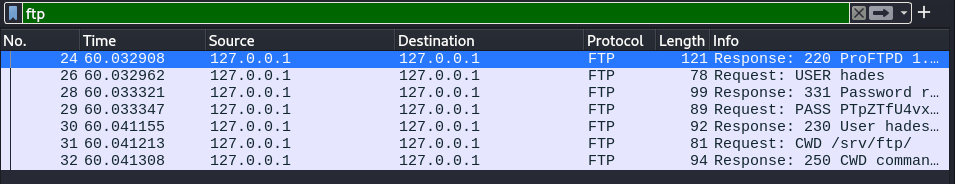
we got something ftp data and it is not encrypted.

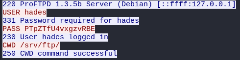
Aye!!! got it something juicy!!!

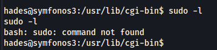
logged in as "hades"...

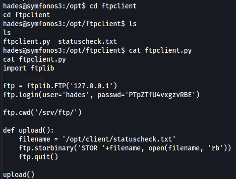
after logged in as hades got to see the ftpclient directory and saw a python file.

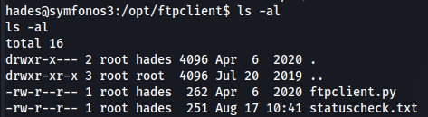
the file ftpclient.py file is owned by the user root so if find a way of adding the reverse shell in that file we can actually get a root shell. But it's not writeable.

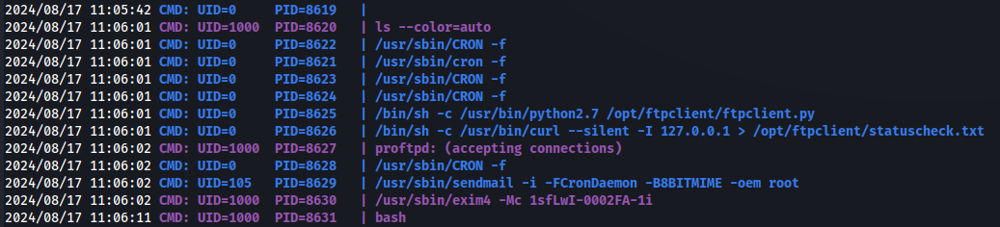
ran pspy script to see all the background processes and the script is running.

in source code of ftpclient.py file, a module is being imported and all the libraries are stored in /lib directory so let's see can we find that module or not.

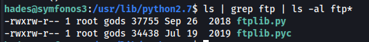
got the module and writeable by gods group.

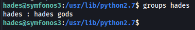
hades is in gods group only so let's add our reverse shell there.

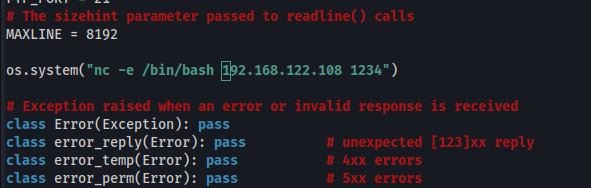
add this in ftplib.py and wait for reverse shell at port 1234.

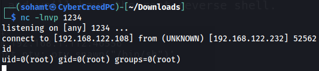
got root shell.

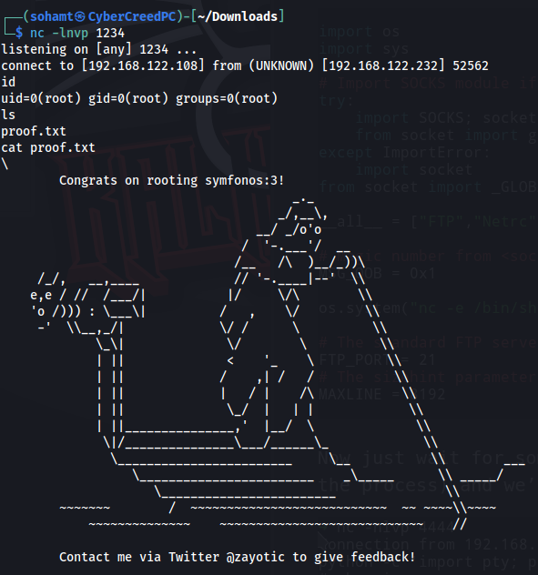
got it...............