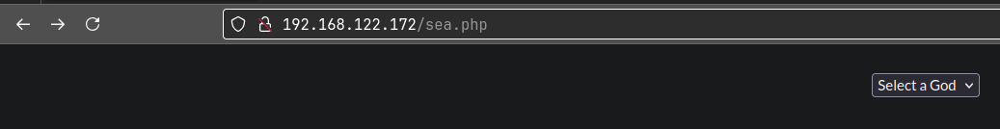
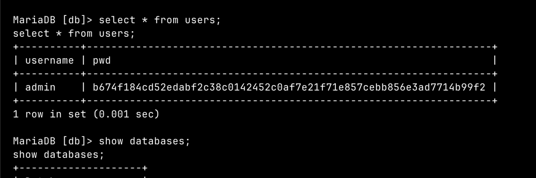
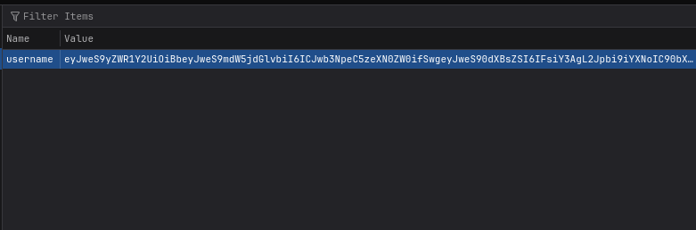

**ip of the machine :- 192.168.122.172**

machine is on!!!

Got two open ports!!!

Aggressive scan didn't reveal something interesting.

Nothing on the website that can be found directly.

Nothing even in the src. code.

Got some directories by directory fuzzing with ffuf.

So, one directory named "manual" showed us the manual for apache web server. Let's see if we can find an vulnerability or exploit associated with the current running version of the apache web server.

So, this time added extensions to find for and also changed the wordlist and got two .php files to look for atlantis.php and sea.php.

sea.php has an option to select god.

After selecting a god it queried in url with a parameter, so maybe LFI is possible here, let's try.

Nah!!! I don't think so LFI is possible here.

Nah!!! Not even xss. Let's try to visit and sea what is in atlantis.php web page.

A login page?

So, added some random creds. and got nothing. 
Just a normal POST request with 200 status code.

So, added SQL injection payload (admin' OR 1=1;--) which is URL encoded and....

Got a redirection to sea.php. So, this means that this login page had a SQL injection vulnerability, so we bypassed login form by SQL injection.

So, /etc/passwd didn't work, but we know that LFI was there, so tried to see auth logs for the ssh as we also have ssh running on the machine.

So, went to "payload all things" and clicked on "file inclusion" category and found these. Log file is what we got or basically we can see, and we need RCE and we also have an ssh port open, so we can try the payload and see if they work or not.

It's php only!!! Let's try it.

Yeah!!! It's not working right now. Let's try to do using metasploit.

It worked i guess.... Let's test it.

Wow, these are recent, so it is working. So, finally did ssh log poisoning in order to perform RCE.

So added url encoded reverse shell payload.

Got reverse shell.

Found one user in the home directory but nothing interesting.

After finding manually in the machine for something, found some files.

a flask code, does this mean that this server is running another application as well on any other port which is not visible to us. Let's see that.

So, 3306 is running mysql whose creds. are still unknown, 22 for ssh and 80 is for http. Then, what is running on port 8080 then. We can see it by port forwarding through ssh on our attacker machine. But we still need creds. for port forwarding. Let's see if we can find any creds.

atlantis.php had creds. hardcoded in it because it is where we performed SQL injection, so checked here to see if we can find anything or not. Let's login into mysql through creds.

I'm in...

So, found some hashes but was unable to crack them.

So, performed password spraying out of curiosity and the password to access the database is on user poseidon as well.

So, logged in as poseidon through ssh and also port forwarded to my localhost 8081.

Now, that's the web page we have forwarded.

So, web page said cookie, so went to check it and it was base64. Let's decode it.

Ok!!! What does this mean now, let's see.

So, i looked at the src. code to see what i can do, i know that cookie is in the form of base64 which is understood. But what the hell is jsonpickle??

So, searched about jsonpickle and came to know that it has deserialisation vulnerability. So wrote a python script to get a base64 and exploit it.

So, on decoding base64, it will look like this.

So, pasted it in the place of cookie.

Ah!!! Internal server error.

But in temp directory got a pwn shell that i created in that script.

Got root.

