**ip :- 192.168.122.68**

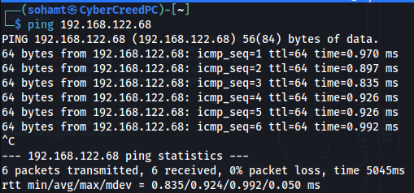
machine on!!!

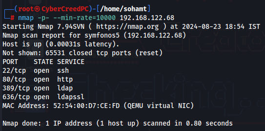
scanned the machine for some ports and saw that ldap is running. Now what the hell is it?

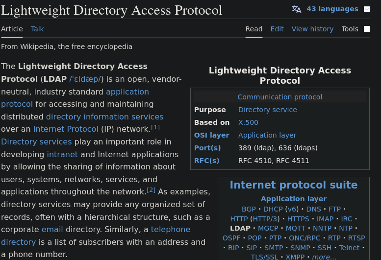
so ldap is like an open directory service for accessing info about system, networks, services etc and makes administration much more easy and as well as vulnerable.

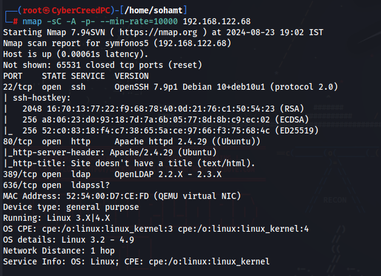
did some versioning and found nothing interesting as such.

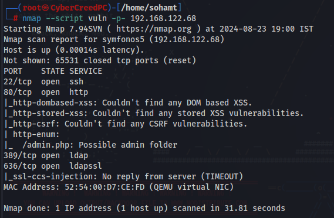
ran script name "vuln" which can find some vulnerabilities before hand and told only about a web page so went there to check.

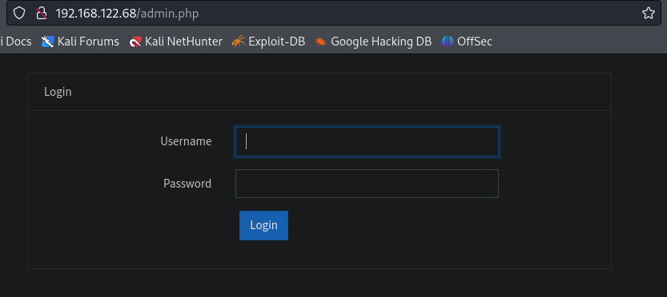
oops!!! got one!!!

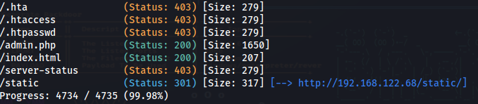
in directory fuzzing found some directories and static directory seems fishy!!!

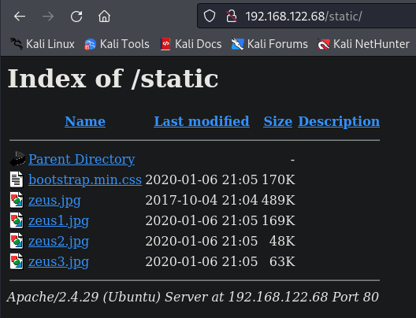
in /static directory found these images and a file. Let's download them and see if we can find something or not.

Used exiftool and binwalk utilities to learn about the exifdata and if there are any hidden files or not respectively and found nothing!!!!

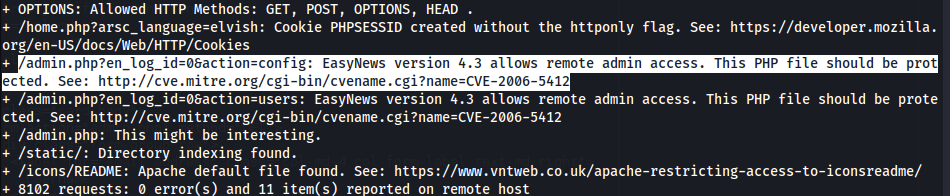
nikto told that RFI (Remote file inclusion) is possible.

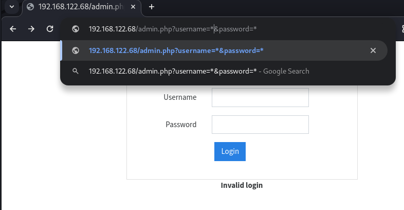
brute forcing and sql injection didn't work so did ldap injection to bypass login page because it is using ldap for authentication and not sql and using asterisk "*" can be helpful 

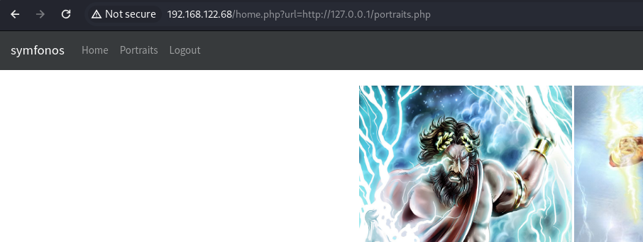
in url it seems like a local file inclusion to me.

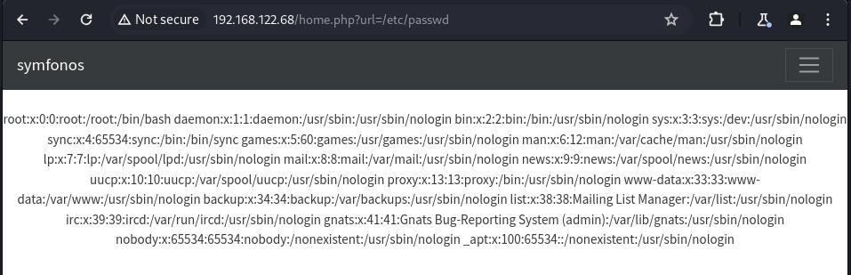
was able to view /etc/passwd file which confirms local file inclusion.

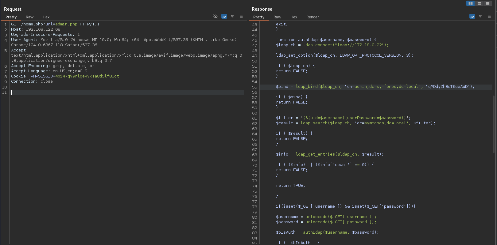
changed request in burp, /home.php?url=admin.php to see about admin and how authentication is going on and other stuff.

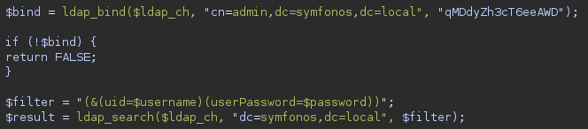
got something for our nmap ldap script.

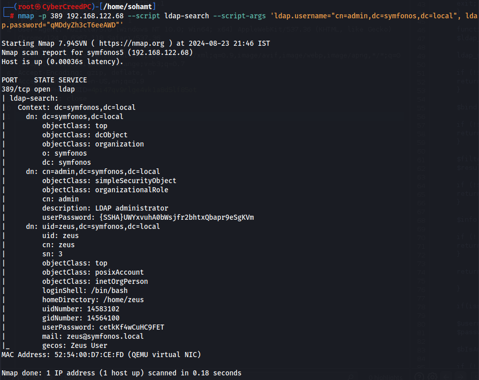
by running a nmap script for ldap "ldap-search" in which we entered what we got from previous result and got username zeus and password.

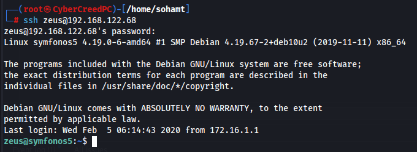
was able to login as zeus.

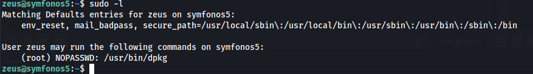
can only run dpkg. Let's search on GTFObins for something.

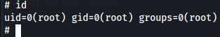
got root

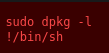
used this exploit from GTFObins to escalate privileges.

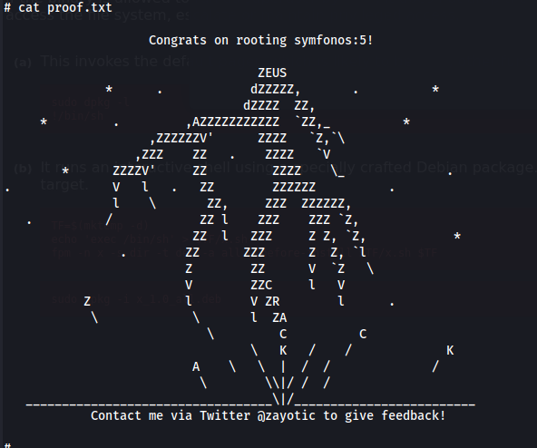
Got it...............................