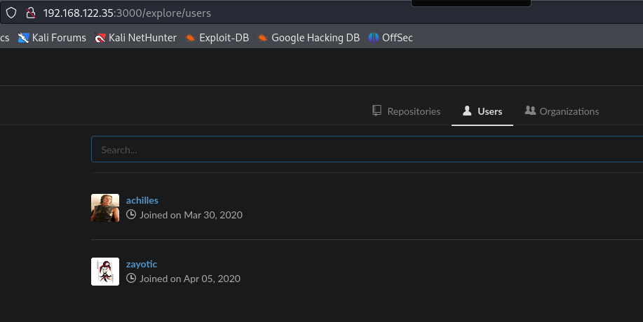
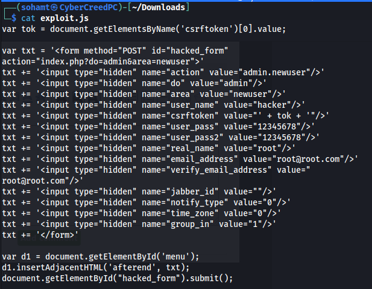
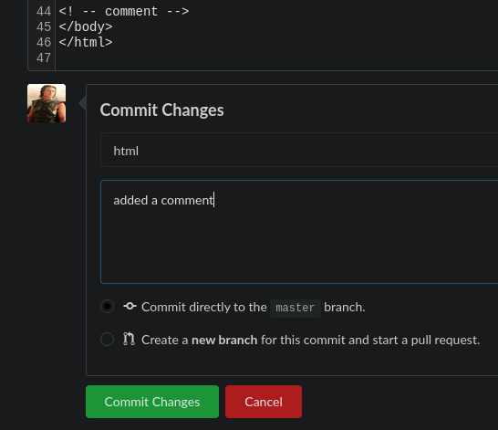

**ip of the machine :- 192.168.122.35**

machine is on!!!

got some open ports!!!

did a versioning scan.

Also ran gobuster and got two directories to look for.

at port 3000 another web server was running so went to check that and found this webpage.

found two possible usernames.

at /flyspray/ found this and when we click at login there is also a login page and register page as well. Let's register as a user and try to check for XSS.

on searchsploit it seems that xss is a very common vulnerability.

on register page tried to add this.

After logging in, going on "edit my details" tab found an xss thus confirming xss vulnerability.

as we know xss vulnerability exists so we change our real name to the exploit from our machine. There is xss vulnerability so it will take it and execute it.

In bug report added a dummy comment.

and after some time it got the exploit from our python server because of xss.

this was the exploit and it also stated that after the exploit is executed it will create a account with creds. "hacker:12345678"

found creds. of one of the users after login

On port 3000 found a login page so let's try to enter these creds. there.

was able to login as the user with creds.

in one of the repo found this which means at port 5000 a REST api is running. But didn't find anything useful in the repositories.

but found the name and version of the software being used.

found only 4 exploits but will use the first one.

After running we get this. To fix it go to settings of the repo then git hooks and then pre recieve and add bash shell there.

add the reverse shell payload.

Now in index.php file in that repo add a commit to start the reverse shell.

got a reverse shell through git.

got possible users. Again "achilles". Let's try to login as achilles with same password.

was able to login as achilles.

user can only run go command.

So if we write the code in go to get a root shell or simply a shell with SUID permissions, we will get root.

This is the script to gain a shell. In this, giving a shell SUID permissions in /tmp directory which will be run as root afterwards in interactive and privileged mode (-ip).

After running the script on target machine, will get a shell in /tmp directory and then execute it in interactive and privileged mode and after getting root flag is yours. 