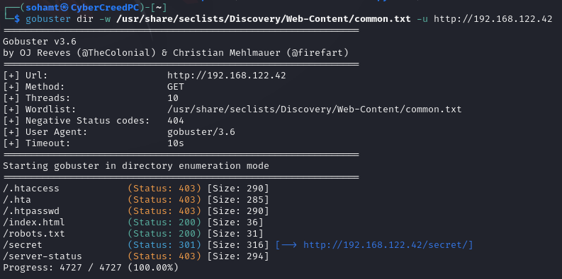

**ip for the machine :- 192.168.122.42**

Machine is up.

got some open ports let's do versioning scan.

Did some versioning. Will run gobuster now.

gobuster scan results show some files and directories.

Nikto scan results. Now let's start viewing these files and directories manually.

robots.txt pointed towards a specific directory.

Nothing found in the /secret directory.

was able to connect directly to the ftp server and got a .pcap file. Let's open it in wireshark.

Followed TCP stream and got something interesting and possible creds and also a file name so we can export object or simply the file.

got it.

Got some info, possibly creds. but of where......?
These creds. not working while trying to do ssh. So after some manual stuff found that it is a directory.

got another file.

the file was an executable so executed it and got another directory.

Got some other directories in one found one.

Got possible usernames file.

Got this in possible passwords file.

Did a lot manually as hydra was showing problems.
and found possible creds.
overflow:Pass.txt

First saw SUID, GUID and World-writable files.

found a file cleaner.py to which we can write.

Now added a shell in it with SUID.

now ran the shell and got flag.........................