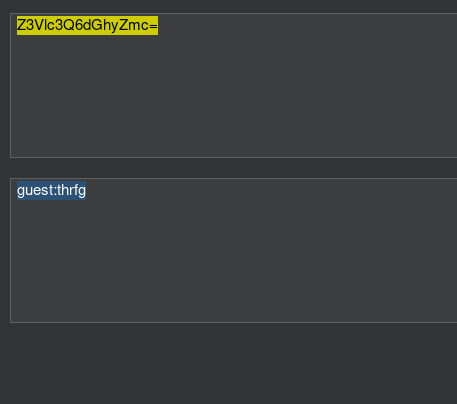

**ip of the machine :- 192.168.122.68**

machine is on!!!

got some open ports!!!

So, got a login page first when entered the web application and it had also had creds. written as guest:guest, so , entered and now in.

ON directory fuzzing, found /admin directory.

It redirected to a login page. So this django admin page doesn't has any default creds. Let's try if SQL injection is possible with username admin or not.

Got the request. But SQL injection is not possible. But recognised the cookie which is base64.

But got some creds. that didn't work anywhere.

So, tried admin:admin and got invalid password. So, after figuring out i came to know that password is done ROT13 and then guest:thrfg is encoded to base64 in order to came up with an auth cookie.

So, let's brute force to search for possible usernames. So, will be using hydra for this purpose.

So, got two usernames. Let's try to craft our own cookie.

Let's change from guest to venus.

Let's try adding this auth cookie.

In response, got a different base64 cookie.

Venus and the password we didn't supply.

As we know password was first ROT13d then base64 so ROT13d the password again and found that we when we supplied wrong cookie in auth (right username, wrong password), it returned right auth cookie (right username, right password).

So, let's try this auth cookie now.

Got another base64 auth cookie. Let's decode it.

Got ROT13 password again.

Got the password. Let's try to login through ssh and if failed then will try creds. on  django admin login page.

So, creds. worked and got initial access to the server.

Got user flag.

So, after manual enumeration didn't find anything, so, using linpeas to find anything for vertical priv. esc.

So, in Linux exploit suggester tab found some cves let's try their exploit for priv. esc.

So, first showed error.

So, this exploit worked for me.

Simply downloaded the zip in compromised machine and then ran the exploit.

Got the root flag.